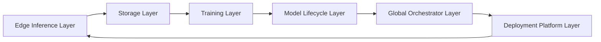
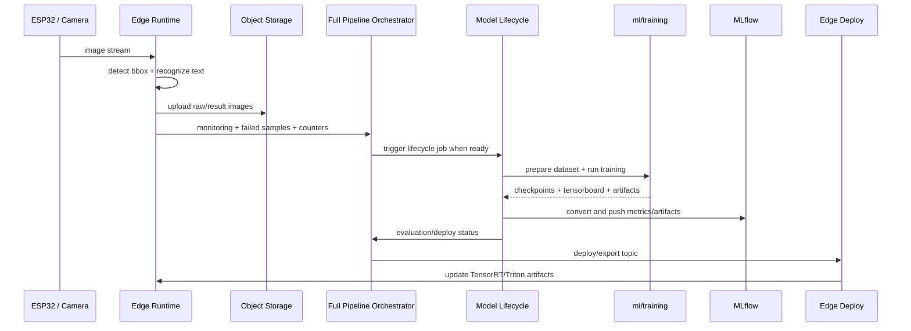

# Full System Architecture

## 1. Overview

Tài liệu này là bản tổng hợp kiến trúc đầy đủ của project `Overwatch Edge AI` dựa trên toàn bộ các tài liệu thành phần đã được viết trước đó.

Mục tiêu của file này:

- gom toàn bộ kiến trúc vào một chỗ
- mô tả quan hệ giữa `training`, `model lifecycle`, `storage`, `edge`, `full orchestrator`, `K8s`, và `CI/CD`
- làm tài liệu gốc để đọc toàn cảnh trước khi đi vào từng source

Đây là project AI production-like theo hướng:

- `edge-to-cloud`
- `closed-loop retraining`
- `multi-service orchestration`
- `Kubernetes deployment`
- `observability-first`

Các source chính:

- `ml/training`
- `services/model-lifecycle-service`
- `services/object-storage-service`
- `services/orchestrators_full_pipeline`
- `edge/jetson`
- `deploy/k8s`

---

## 2. System Layers

Kiến trúc tổng thể của project được chia thành 6 lớp chính:

1. `Data acquisition and edge inference layer`
2. `Artifact and dataset storage layer`
3. `Model training and export layer`
4. `Model lifecycle orchestration layer`
5. `Global pipeline orchestration and observability layer`
6. `Deployment and runtime platform layer`

---

## 3. Source Map

### 3.1. `edge/jetson`

Đây là `edge inference plane`.

Thành phần:

- `Triton`
- `C++ runtime`
- `Web UI`
- `Go edge orchestrator`

Vai trò:

- nhận ảnh từ thiết bị như `ESP32`
- gọi `YOLO` để detect bbox
- gọi `ViT-CTC recognizer` để nhận dạng text
- hiển thị realtime cho user
- lưu ảnh/kết quả ra SSD cục bộ
- upload dữ liệu hoặc chờ orchestrator trung tâm lấy dữ liệu
- nhận lệnh deploy/export TensorRT từ tầng orchestrator phía trên

### 3.2. `ml/training`

Đây là `training plane`.

Thành phần:

- pipeline train `recognizer`
- pipeline train `detection`
- hook `TensorBoard`
- checkpoint
- export `ONNX`
- script `export_*_tensorrt`

Vai trò:

- huấn luyện model mới
- tạo checkpoint và artifact trung gian
- tạo output cho lifecycle, MLflow, deploy

### 3.3. `services/model-lifecycle-service`

Đây là `AI lifecycle orchestrator`.

Vai trò:

- tải dataset version
- merge `gold_data`
- chuẩn bị dataset cho `ml/training`
- gọi script train theo topic
- convert TensorBoard sang MLflow
- upload artifact và dataset lên MinIO
- tạo `gold_data_v`
- gọi pseudo-label bằng strong OCR model nếu cần
- route sang evaluation
- route sang deploy

### 3.4. `services/object-storage-service`

Đây là `storage gateway`.

Vai trò:

- cấp `upload URL`
- cấp `download URL`
- quản lý `bucket`
- bảo vệ truy cập MinIO bằng token

### 3.5. `services/orchestrators_full_pipeline`

Đây là `orchestrator của các orchestrator`.

Vai trò:

- thu thập monitoring từ toàn hệ
- healthcheck tất cả server
- route topic theo state
- kiểm tra SQL status
- retry workflow nếu lỗi
- publish command tới service con
- ghi log Loki
- export Prometheus
- bắn Alertmanager

### 3.6. `deploy/k8s`

Đây là `deployment plane`.

Vai trò:

- map các service lên cluster K8s
- tách node `CPU`, `GPU`, `Jetson`
- dùng `Tailscale` làm private node-to-node connectivity
- triển khai control plane, training plane, edge plane

---

## 4. End-to-End AI Lifecycle

Luồng end-to-end của hệ thống đi theo vòng lặp khép kín:

Các stage chính:

1. thu ảnh và suy luận tại edge
2. lưu dữ liệu và metadata
3. thu failed samples hoặc data mới
4. đủ điều kiện thì mở pipeline lifecycle
5. train model mới
6. monitor, evaluate, store artifacts
7. deploy lại xuống edge
8. tiếp tục thu dữ liệu và lặp lại

---

## 5. Closed-Loop Data Improvement

Project này không phải pipeline inference một chiều.

Nó được thiết kế theo vòng lặp cải thiện model:

1. `edge` sinh dữ liệu thật
2. các mẫu fail được giữ lại
3. orchestrator tổng đếm dataset readiness
4. lifecycle service gọi:
   - pseudo-label bằng strong OCR model
   - hoặc tạo `gold_data`
5. `gold_data_v` được merge với `dataset_(v-1)`
6. training pipeline chạy lại
7. model tốt hơn thì deploy xuống edge

Điểm mạnh của cấu trúc này:

- model học từ dữ liệu thực
- không cần dừng ở một dataset tĩnh
- edge và training liên kết chặt nhưng vẫn tách service rõ

---

## 6. Observability And Control Plane

Toàn bộ hệ thống được điều phối bởi:

- `services/orchestrators_full_pipeline`

Nó quan sát:

- `edge/jetson`
- `Triton`
- `web ui`
- `model-lifecycle-service`
- `object-storage-service`
- `MinIO`
- `MLflow`
- `Kafka`
- `SQL`

Nó ghi:

- `Loki logs`
- `Prometheus metrics`
- `Alertmanager alerts`

Nó quyết định:

- khi nào route topic
- khi nào retry
- khi nào dừng route vì service unhealthy
- khi nào deploy

Đây là điểm tạo ra signal `production-like` mạnh nhất cho project.

---

## 7. Deployment Topology

Project được thiết kế để chạy trên `1 K8s cluster` với `3 node`:

1. `CPU server`
2. `GPU 1650Ti server`
3. `Jetson Orin Nano`

Tất cả node kết nối bằng `Tailscale IP nội bộ`.

### 7.1. CPU node

Chạy:

- `orchestrators_full_pipeline`
- `model-lifecycle-service`
- `object-storage-service`
- `Kafka`
- `SQL`
- `MLflow`
- `Prometheus`
- `Loki`
- `Alertmanager`

### 7.2. GPU node

Chạy:

- `ml/training jobs`
- benchmark GPU workloads
- GPU exporters

### 7.3. Jetson node

Chạy:

- `Triton`
- `C++ runtime`
- `Web UI`
- `edge go orchestrator`

Mô hình này tách rõ:

- `control plane`
- `training plane`
- `edge inference plane`

---

## 8. Runtime And Release Artifacts

Artifact đi qua các lớp sau:

- checkpoint từ `ml/training`
- tensorboard logs
- MLflow metrics/artifacts
- zipped dataset version
- `gold_data_v`
- `ONNX`
- TensorRT engines
- Triton model repository contents

Luồng artifact chuẩn:

1. training tạo checkpoint/log
2. lifecycle chuyển metrics sang MLflow
3. lifecycle upload artifact lên MinIO
4. evaluation quyết định promote
5. edge export/deploy tạo runtime artifact TensorRT
6. Triton load artifact mới

---

## 9. CI/CD Position In The Architecture

Ngoài runtime system, project còn cần một `delivery pipeline` để biến source code thành:

- image chạy được
- test pass
- pod K8s ổn định
- cutover dần từ Docker runtime cũ sang K8s

Trong project này, `CI/CD` không chỉ build image.

Nó phải:

1. chạy unit/integration test của từng service
2. chạy test end-to-end có kiểm soát thời gian
3. skip các bước mock nặng hoặc output tốn thời gian
4. giữ các file env, test fixture, test data ở thư mục được version control
5. rebuild Docker image cho các service đã đổi
6. push image/tag phù hợp
7. rollout dần lên K8s
8. tắt dần Docker runtime cũ sau khi pod mới ổn định

Phần này được mô tả chi tiết hơn trong:

- [ci-cd-and-release-flow.md](/home/minhtk/code/overwatch-edge-ai/worktree/backend_nexus/docs/architecture/ci-cd-and-release-flow.md)

---

## 10. Recommended Reading Order

Để hiểu project nhanh, nên đọc theo thứ tự:

1. file này
2. [system-architecture-overview.md](/home/minhtk/code/overwatch-edge-ai/worktree/backend_nexus/docs/architecture/system-architecture-overview.md)
3. [training-source-flow.md](/home/minhtk/code/overwatch-edge-ai/worktree/backend_nexus/ml/training/training-source-flow.md)
4. [model-lifecycle-orchestrator-flow.md](/home/minhtk/code/overwatch-edge-ai/worktree/backend_nexus/services/model-lifecycle-service/model-lifecycle-orchestrator-flow.md)
5. [object-storage-service-flow.md](/home/minhtk/code/overwatch-edge-ai/worktree/backend_nexus/services/object-storage-service/object-storage-service-flow.md)
6. [runtime-inference-orchestration-flow.md](/home/minhtk/code/overwatch-edge-ai/worktree/backend_nexus/edge/jetson/runtime-inference-orchestration-flow.md)
7. [orchestrators-full-pipeline-flow.md](/home/minhtk/code/overwatch-edge-ai/worktree/backend_nexus/services/orchestrators_full_pipeline/orchestrators-full-pipeline-flow.md)
8. [k8s-cluster-deployment-flow.md](/home/minhtk/code/overwatch-edge-ai/worktree/backend_nexus/deploy/k8s/k8s-cluster-deployment-flow.md)
9. [ci-cd-and-release-flow.md](/home/minhtk/code/overwatch-edge-ai/worktree/backend_nexus/docs/architecture/ci-cd-and-release-flow.md)

---

## 11. Final Assessment Of The Architecture

Nếu nhìn như một project cá nhân, kiến trúc này đã thể hiện rất rõ tư duy:

- tách service theo bounded responsibility
- có data plane, training plane, inference plane, control plane
- có observability
- có rollout loop từ dữ liệu thật về training và quay lại edge
- có tư duy K8s thay vì chỉ Docker đơn lẻ

Nó chưa đồng nghĩa mọi phần implementation đã hoàn thiện.

Nhưng ở mức kiến trúc, đây là một nền tảng rất mạnh để tiến tới một `production-like applied AI system`.
