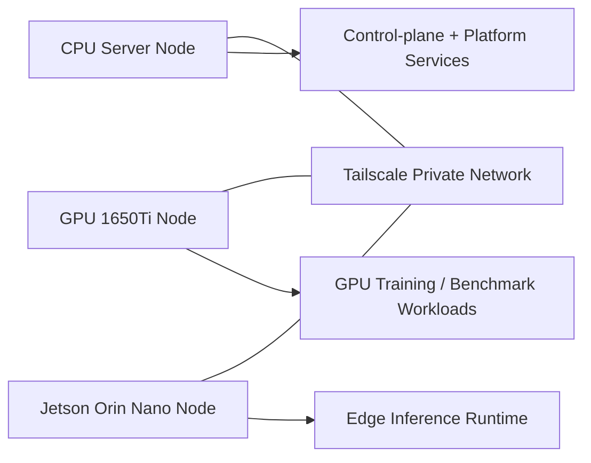
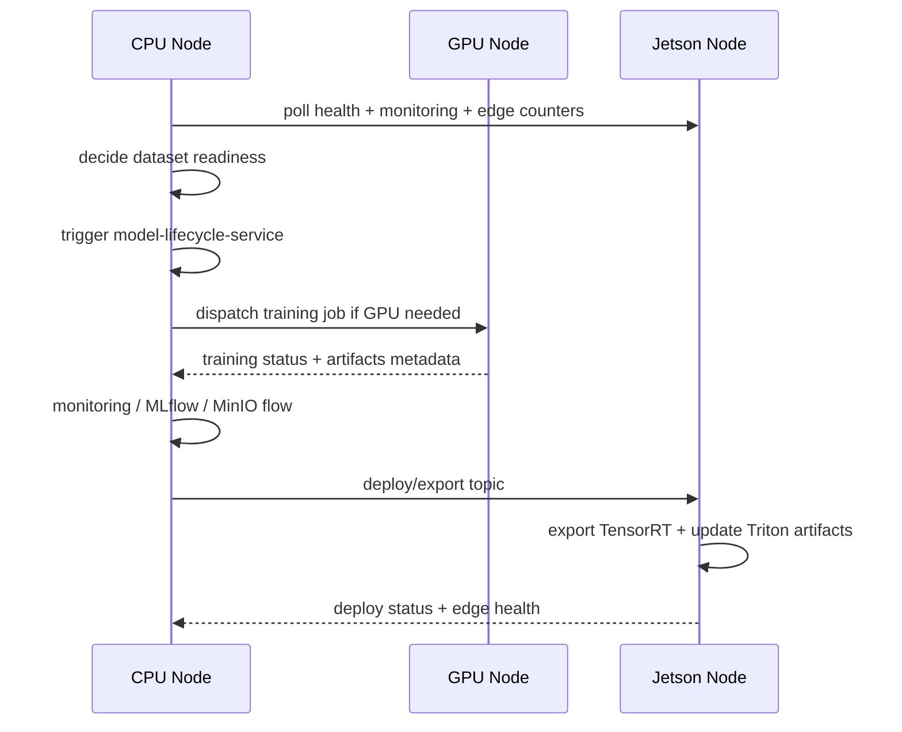

# K8s Cluster Deployment Flow

## 1. Overview

Thư mục `deploy/k8s` là nơi mô tả cách map toàn bộ project này lên một `Kubernetes cluster` chạy trên `3 máy vật lý`.

Giả định của tài liệu này:

- dùng `1 cluster K8s chung`
- `mỗi service = 1 container độc lập`
- `mỗi container chạy trong 1 pod`
- các service nội bộ và service phụ trợ ngoài hệ thống đều được container hóa
- cả `3 máy` kết nối với nhau qua `IP nội bộ Tailscale`

Ba máy mục tiêu:

1. `server CPU mạnh`
2. `server GPU GTX 1650Ti` để demo GPU workload
3. `edge Jetson Orin Nano`

Mục tiêu của topology này:

- có một control plane thống nhất
- tách được `control plane`, `training plane`, `edge inference plane`
- triển khai service theo đúng đặc tính phần cứng của từng node
- giữ network riêng tư qua `Tailscale`
- dễ mở rộng sau này sang nhiều edge node khác

Sơ đồ tổng:



---

## 2. Cluster Topology

Phương án được chọn là:

- `1 K8s cluster`
- `3 node`
- các node kết nối nội bộ bằng `Tailscale`

### 2.1. Tại sao dùng 1 cluster chung

Ưu điểm:

- service discovery thống nhất
- dễ quản lý pod placement
- dễ dùng `nodeSelector`, `taints/tolerations`, `affinity`
- observability chung cho toàn hệ
- orchestration job train/deploy/monitoring dễ hơn

Nhược điểm:

- setup phức tạp hơn 3 host rời
- cần cẩn thận với networking giữa node thường và edge node
- Jetson có tài nguyên hạn chế nên phải giới hạn workload rất chặt

### 2.2. Thành phần cluster nên có

- `control-plane node` có thể đặt trên `server CPU mạnh`
- `worker node GPU`
- `worker node edge`

Nếu muốn nhẹ hơn cho demo:

- `CPU server` có thể vừa là `control-plane` vừa là `worker`

### 2.3. Loại workload trong cluster

Cluster này chứa 4 lớp workload:

- `platform services`
- `AI lifecycle services`
- `training / GPU jobs`
- `edge inference services`

---

## 3. Node Role Mapping

### 3.1. CPU server node

Node này nên gánh phần `control-plane` và các service backend chính.

Service nên đặt ở đây:

- `orchestrators_full_pipeline`
- `model-lifecycle-service`
- `object-storage-service`
- `Kafka`
- `SQL database`
- `Prometheus`
- `Loki`
- `Alertmanager`
- `MLflow`
- `Grafana` nếu có
- ingress/controller nội bộ nếu cần

Vai trò:

- trung tâm điều phối
- trung tâm state
- trung tâm monitoring/logging
- nơi giữ phần lớn service không cần GPU

### 3.2. GPU 1650Ti node

Node này dành cho workload cần GPU nhưng chưa phải edge.

Service hoặc job nên đặt ở đây:

- `ml/training` job cho demo
- benchmark inference
- export/convert model nếu cần GPU
- các pod thử nghiệm CUDA/PyTorch
- `nvidia device plugin`
- `dcgm exporter` hoặc GPU metrics exporter

Vai trò:

- training node
- benchmark node
- staging GPU node

### 3.3. Jetson Orin Nano node

Node này dành cho runtime inference ngoài edge.

Service nên đặt ở đây:

- `Triton Inference Server`
- `C++ runtime`
- `Web UI`
- `Go edge orchestrator`
- node metrics exporter cho Jetson

Vai trò:

- edge inference node
- TensorRT runtime node
- realtime display node

### 3.4. Node labeling đề xuất

Nên gắn label cho node như sau:

- `node-role.ai/control-plane=true`
- `node-role.ai/backend=true`
- `node-role.ai/gpu=true`
- `node-role.ai/edge=true`
- `node-role.ai/jetson=true`

Mục tiêu:

- route pod đúng node
- tránh pod chạy sai phần cứng

---

## 4. Networking With Tailscale

Ba node kết nối qua `Tailscale IP nội bộ`.

Điều này có nghĩa:

- node-to-node traffic không đi qua public internet
- cụm K8s có một lớp private connectivity ổn định hơn
- đặc biệt hữu ích khi `Jetson Orin Nano` ở mạng khác

### 4.1. Vai trò của Tailscale

`Tailscale` trong kiến trúc này đóng vai:

- private overlay network giữa 3 máy
- lớp connectivity ổn định để join cluster
- lớp truy cập an toàn cho admin hoặc remote debug

### 4.2. Tailscale không thay thế cluster networking

Điểm cần hiểu rõ:

- `Tailscale` giúp các `node` nhìn thấy nhau qua IP riêng
- còn `pod-to-pod` và `service-to-service` trong cluster vẫn cần `CNI`

Nghĩa là:

- `Tailscale` dùng ở mức host/node
- `CNI` dùng ở mức K8s pod/service

### 4.3. Networking stack đề xuất

Nên có:

- `Tailscale` cho node connectivity
- một `CNI` như `Calico`, `Cilium`, hoặc giải pháp nhẹ phù hợp cluster nhỏ
- `CoreDNS`
- `kube-proxy` hoặc data plane tương đương

### 4.4. Luồng traffic chính

`Control-plane traffic`:

- CPU node <-> GPU node
- CPU node <-> Jetson node

`AI workflow traffic`:

- `orchestrators_full_pipeline` -> `model-lifecycle-service`
- `model-lifecycle-service` -> `object-storage-service`
- `model-lifecycle-service` -> `ml/training` job
- `orchestrators_full_pipeline` -> `edge orchestrator`

`Inference traffic`:

- `C++ runtime` -> `Triton`
- `C++ runtime` -> `Web UI`
- `edge orchestrator` -> `Triton`

### 4.5. Kết nối admin và monitoring

`Tailscale` cũng phù hợp để:

- truy cập `Grafana`
- truy cập `MLflow UI`
- truy cập `Prometheus`
- SSH hoặc debug node

Không nên mở rộng các service này ra public internet nếu không cần.

---

## 5. Pod Placement Strategy

Vì mỗi service là 1 container độc lập và mỗi container là 1 pod, pod placement là phần rất quan trọng.

### 5.1. Pod placement cho control-plane services

Pod nên chạy trên `CPU server`:

- `orchestrators_full_pipeline`
- `model-lifecycle-service`
- `object-storage-service`
- `Kafka`
- `SQL`
- `MLflow`
- `Prometheus`
- `Loki`
- `Alertmanager`

Lý do:

- các service này không cần GPU
- cần ổn định
- nên ở node có tài nguyên CPU/RAM lớn hơn Jetson

### 5.2. Pod placement cho GPU workloads

Pod nên chạy trên `GPU node`:

- training jobs
- benchmark jobs
- ONNX/TensorRT experiment jobs nếu cần CUDA

Nên dùng:

- `nodeSelector`
- `resource requests/limits`
- `runtimeClass` hoặc cấu hình NVIDIA nếu cần

### 5.3. Pod placement cho edge workloads

Pod nên chạy trên `Jetson`:

- `triton`
- `cpp-runtime`
- `web-ui`
- `edge-go-orchestrator`

Nên có:

- `nodeSelector` theo label edge
- giới hạn tài nguyên chặt
- ưu tiên `hostPath` hoặc volume cục bộ cho SSD nếu pipeline cần lưu ảnh tạm

### 5.4. Taints và tolerations

Nên dùng:

- taint cho `GPU node` để workload thường không tự chạy vào
- taint cho `Jetson node` để pod backend không vô tình chiếm tài nguyên edge

Ví dụ mục tiêu:

- chỉ pod có `toleration` phù hợp mới chạy lên `GPU` hoặc `Jetson`

### 5.5. Affinity và anti-affinity

Nên cân nhắc:

- anti-affinity cho `Kafka`, `SQL`, `MLflow` nếu sau này scale nhiều replica
- affinity giữa pod và node phù hợp phần cứng

Trong demo nhỏ, có thể đơn giản hơn, nhưng về tư duy nên có từ đầu.

---

## 6. Workload Flow Across 3 Machines

### 6.1. Full lifecycle flow



### 6.2. Training flow

Luồng train điển hình:

1. `orchestrators_full_pipeline` trên CPU quyết định đủ điều kiện train
2. gửi command tới `model-lifecycle-service`
3. `model-lifecycle-service` chuẩn bị dataset
4. tạo training job trên `GPU node`
5. training job chạy script từ `ml/training`
6. artifact và monitoring được đẩy ngược về CPU-side services

### 6.3. Monitoring flow

Monitoring chạy theo hướng:

- `Jetson` gửi/được scrape metrics inference và tài nguyên edge
- `GPU node` gửi/được scrape metrics train và GPU
- `CPU node` thu metrics hệ thống, Kafka, SQL, MLflow, MinIO

Tất cả hội tụ về:

- `Prometheus`
- `Loki`
- `Alertmanager`

### 6.4. Deploy flow

Deploy mới cho edge đi theo hướng:

1. CPU-side orchestrator quyết định deploy
2. publish command
3. edge orchestrator trên Jetson nhận lệnh
4. chạy `export_*_tensorrt`
5. update artifact cho Triton
6. healthcheck Triton
7. báo trạng thái ngược lại

---

## 7. Service Mapping To Pods

### 7.1. Control-plane and platform pods

Các pod nên có:

- `orchestrators-full-pipeline`
- `model-lifecycle-service`
- `object-storage-service`
- `kafka`
- `postgres` hoặc SQL tương đương
- `mlflow`
- `prometheus`
- `loki`
- `alertmanager`
- `grafana` nếu cần UI quan sát

### 7.2. GPU-side pods

Các pod nên có:

- `training-job-runner`
- `gpu-metrics-exporter`
- pod phụ cho benchmark nếu cần

### 7.3. Edge-side pods

Các pod nên có:

- `triton-server`
- `cpp-inference-runtime`
- `edge-web-ui`
- `edge-go-orchestrator`
- `jetson-metrics-exporter`

### 7.4. Batch job và long-running service

Nên tách:

- `Deployment` cho service chạy lâu dài
- `Job` hoặc `CronJob` cho workload batch như training, reconciliation, cleanup

Ví dụ:

- `model-lifecycle-service` là `Deployment`
- `orchestrators_full_pipeline` là `Deployment`
- training là `Job`
- periodic reconciliation có thể là `CronJob` nếu không nhúng vào service chính

---

## 8. Observability Stack On K8s

### 8.1. Prometheus

`Prometheus` nên chạy ở `CPU node`.

Nhiệm vụ:

- scrape metrics từ mọi pod
- scrape metrics từ node exporters
- scrape GPU metrics
- scrape Triton metrics
- scrape Kafka/SQL nếu có exporter

### 8.2. Loki

`Loki` cũng nên ở `CPU node`.

Nhiệm vụ:

- nhận log từ tất cả service
- gom log để trace pipeline xuyên qua nhiều node

### 8.3. Alertmanager

`Alertmanager` chạy ở `CPU node`.

Nhiệm vụ:

- nhận alert từ Prometheus
- gửi thông báo khi:
  - node down
  - pod crashloop
  - Triton unhealthy
  - GPU job fail
  - training stuck
  - edge deploy fail

### 8.4. Metrics cần quan sát

Ít nhất nên có:

- CPU/RAM/SSD toàn node
- GPU usage node 1650Ti
- GPU/NPU hoặc metrics tương đương của Jetson nếu lấy được
- pod restart count
- Kafka lag
- SQL latency
- MLflow availability
- MinIO availability
- Triton live/ready
- training job duration
- deploy success/fail

---

## 9. Storage And Artifact Flow

### 9.1. Central artifact direction

Artifact chính nên hội tụ về CPU-side storage services.

Luồng chuẩn:

- training job tạo artifact trên `GPU node`
- upload qua `object-storage-service`
- lưu vào `MinIO`
- metadata ghi vào `MLflow`

### 9.2. Edge local storage

`Jetson` vẫn nên có local storage cho:

- ảnh inference tạm
- ảnh overlay
- cache artifact
- TensorRT engine local

Đây là storage cục bộ của edge, không thay thế object storage trung tâm.

### 9.3. Volume strategy

Nên có:

- `PersistentVolume` hoặc local volume cho DB/observability nếu cần
- local volume cho Jetson SSD
- volume cho Triton model repository

Trong demo, có thể đơn giản hóa, nhưng về thiết kế nên tách rõ:

- `central persistent storage`
- `edge local cache/storage`

---

## 10. Security And Internal Access

### 10.1. Tailscale as private node network

Mọi giao tiếp node-level nên đi qua `Tailscale IP`.

Điều này giảm:

- phụ thuộc vào public IP
- rủi ro expose management interfaces

### 10.2. Service exposure strategy

Không phải service nào cũng cần expose ra ngoài.

Nên chia:

- `cluster-internal only`
- `tailscale-admin access only`
- `public access` nếu thật sự cần

Thông thường:

- `SQL`, `Kafka`, `object-storage-service`, `model-lifecycle-service` nên là internal
- `Grafana`, `MLflow` có thể chỉ mở cho admin qua Tailscale
- `Web UI` ở edge có thể expose giới hạn tùy nhu cầu demo

### 10.3. Secrets

Nên quản lý bằng:

- `Kubernetes Secrets`
- không hardcode credential trong image

Bao gồm:

- MinIO credentials
- SQL credentials
- Kafka auth nếu có
- MLflow config
- JWT/refresh token cho object storage
- service API keys

---

## 11. Failure And Recovery

### 11.1. CPU node failure

Nếu `CPU node` chết:

- phần lớn control-plane sẽ dừng
- monitoring và orchestration sẽ ảnh hưởng mạnh

Vì đây là demo cluster nhỏ, có thể chấp nhận.

Nếu muốn cứng hơn sau này:

- tách HA control-plane
- tách DB và Kafka replica

### 11.2. GPU node failure

Nếu `GPU node` chết:

- training demo dừng
- edge inference vẫn có thể chạy

Điều này cho thấy training plane và edge plane đã được tách tương đối tốt.

### 11.3. Jetson node failure

Nếu `Jetson` chết:

- edge inference dừng
- CPU/GPU side vẫn còn lifecycle, storage, monitoring trung tâm

Orchestrator tổng nên:

- đánh dấu edge unhealthy
- dừng deploy command mới
- cảnh báo lên Alertmanager

### 11.4. Tailscale disruption

Nếu `Tailscale` giữa node lỗi:

- cluster communication liên node có thể hỏng
- scrape metrics liên node có thể fail
- control plane route lệnh sang edge/gpu có thể fail

Vì vậy cần:

- healthcheck node-to-node
- alert riêng cho connectivity

---

## 12. Suggested K8s Manifests Layout

Thư mục `deploy/k8s/manifests` hiện đã có:

- `base`
- `overlays`

Nên mở rộng theo hướng:

```text
deploy/k8s/
├── k8s-cluster-deployment-flow.md
└── manifests/
    ├── base/
    │   ├── namespaces/
    │   ├── platform/
    │   ├── lifecycle/
    │   ├── training/
    │   ├── edge/
    │   ├── observability/
    │   └── networking/
    └── overlays/
        ├── demo/
        ├── local/
        └── production-like/
```

### 12.1. Nhóm manifest nên có

`platform`:

- Kafka
- SQL
- MLflow
- object-storage-service

`lifecycle`:

- model-lifecycle-service
- orchestrators_full_pipeline

`training`:

- GPU job templates

`edge`:

- Triton
- C++ runtime
- Web UI
- edge go orchestrator

`observability`:

- Prometheus
- Loki
- Alertmanager
- exporters

### 12.2. Overlay theo môi trường

`demo`:

- tối ưu cho 3 node hiện tại
- resource nhỏ hơn
- chấp nhận single replica

`production-like`:

- chặt hơn về affinity
- secrets rõ hơn
- nhiều healthcheck hơn

---

## 13. Final Position Of This Deployment Model

Mô hình deploy này biến repo hiện tại thành một hệ AI phân tách đúng vai:

- `CPU node` giữ control plane và stateful services
- `GPU node` giữ training/demo GPU plane
- `Jetson node` giữ edge inference plane

`Tailscale` cung cấp private node-to-node connectivity.

`Kubernetes` cung cấp:

- scheduling
- service discovery
- restart/recovery
- pod isolation
- deployment control

Nếu nhìn ở mức kiến trúc, đây là một mô hình rất hợp lý cho:

- demo production-like
- applied AI platform nhỏ
- edge-to-cloud AI lifecycle thử nghiệm nhưng có cấu trúc rõ ràng
