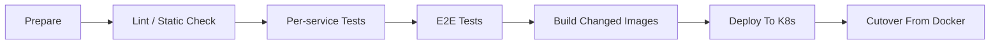
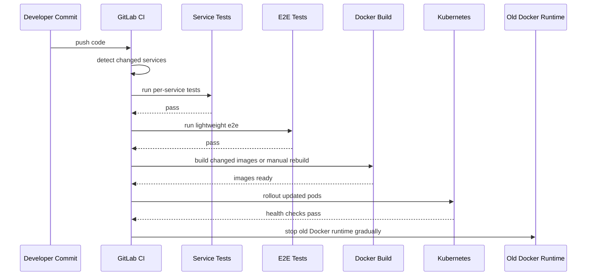

# CI/CD And Release Flow

## 1. Overview

Tài liệu này mô tả phần `CI/CD`, `test strategy`, `Docker rebuild`, và `cutover` từ runtime Docker cũ sang `Kubernetes`.

Mục tiêu:

- khi code thay đổi, hệ thống biết phải test gì
- biết service nào cần rebuild image
- biết file test và env phải đặt ở đâu để không bị mất khi `GitLab Runner` clone source mới
- biết cách rollout dần từ Docker sang K8s

Lưu ý hiện trạng:

- repo đã có `.gitlab-ci.yml`
- nhưng tài liệu này đang mô tả `target CI/CD architecture` rõ hơn hiện trạng file pipeline

---

## 2. Delivery Goals

Pipeline CI/CD của project này nên đạt các mục tiêu sau:

1. kiểm tra code theo service
2. chạy `unit/integration test` của từng service
3. chạy `test_e2e` chọn lọc
4. skip các bước mock output tốn thời gian hoặc không cần cho CI chính
5. build lại image chỉ cho service bị ảnh hưởng
6. cho phép `manual rebuild` nếu cần ép build lại
7. rollout dần từ Docker runtime cũ sang K8s
8. chỉ tắt Docker khi pod K8s mới thực sự ổn định

---

## 3. Test Layout Strategy

### 3.1. Vấn đề cần giải quyết

`GitLab Runner` khi clone repo sẽ chỉ thấy file đã commit.

Nó sẽ không giữ:

- file env local chưa commit
- file output test sinh tạm
- file fixture đặt sai chỗ ngoài repo

Vì vậy các thứ phục vụ test phải được đặt trong thư mục được quản lý bởi repo.

### 3.2. Nơi nên đặt file test và env

Nên giữ các file cần cho CI trong repo ở các nhóm sau:

- `services/*/tests/`
- `services/*/test_e2e/`
- `services/*/config/ci/`
- `ml/training/tests/`
- `ml/training/test_e2e/` nếu có
- `deploy/docker/env/`
- `deploy/k8s/manifests/overlays/demo/`
- `tests/fixtures/` nếu sau này có shared fixture

### 3.3. Loại file nên commit

Nên commit:

- `.env.example`
- `.env.ci`
- config test YAML
- fixture JSON
- fixture manifest
- sample input nhỏ
- mock response nhỏ
- script bootstrap test

Không nên phụ thuộc vào:

- file local chỉ có trên máy dev
- artifact nặng sinh tạm
- log output cũ
- checkpoint quá lớn nếu không thật sự cần

### 3.4. Rule cho test data

Test data nên:

- nhỏ
- deterministic
- đủ để xác minh logic
- không yêu cầu GPU thật trừ job riêng

---

## 4. CI Pipeline Stages

Pipeline nên có các stage sau:

1. `prepare`
2. `lint or static checks`
3. `service tests`
4. `end-to-end tests`
5. `build images`
6. `release or deploy`
7. `cutover and cleanup`



---

## 5. Per-Service Test Flow

Mỗi service cần có test riêng trước khi chạy luồng hệ thống.

### 5.1. Services cần test riêng

- `services/object-storage-service`
- `services/model-lifecycle-service`
- `services/orchestrators_full_pipeline` khi source này có code
- `edge/jetson` cho phần có thể test được
- `ml/training`

### 5.2. Kiểu test theo service

`object-storage-service`:

- unit test token
- config loader test
- MinIO adapter test
- gRPC handler test
- e2e service test có thể mock MinIO hoặc dùng môi trường nhẹ

`model-lifecycle-service`:

- use case test
- Kafka handler test
- dataset shaping test
- upload/download flow test
- health/grpc test

`ml/training`:

- config and utility tests
- dataset transform tests
- manifest tests
- export tests
- skip training thật nặng trong main CI nếu không cần

`edge/jetson`:

- config parsing
- orchestration logic
- integration mock cho Triton client
- không nhất thiết chạy full realtime inference trong mọi pipeline

### 5.3. Điều kiện pass

Một service chỉ được coi là pass nếu:

- test của chính nó pass
- không phá vỡ contract cơ bản với service liên quan

---

## 6. End-to-End Test Strategy

### 6.1. Mục tiêu

Test `e2e` ở đây không nhất thiết phải chạy hết toàn bộ luồng nặng như production.

Mục tiêu là:

- xác minh service nối với nhau đúng
- xác minh contract chính không vỡ
- xác minh command flow chính chạy qua được

### 6.2. Những gì nên test thật

Nên test thật:

- service boot được
- gRPC/HTTP endpoint chính trả lời
- Kafka command flow chính chạy được
- upload/download URL flow hoạt động
- SQL state được cập nhật
- rollout command được publish đúng

### 6.3. Những gì nên skip hoặc mock

Nên skip hoặc mock:

- full training nhiều giờ
- full TensorRT export nặng
- inference dài trên lượng ảnh lớn
- upload artifact lớn
- mock output tốn thời gian nhưng không tăng giá trị kiểm chứng

### 6.4. Ví dụ e2e “production-like nhưng nhẹ”

1. tạo request train giả
2. route qua `orchestrators_full_pipeline`
3. `model-lifecycle-service` nhận command
4. giả lập output training thành công
5. chạy nhánh MLflow/MinIO giả lập
6. publish evaluation passed
7. publish deploy command
8. xác minh edge topic nhận đúng payload

---

## 7. Change Detection And Selective Build

### 7.1. Tại sao cần build chọn lọc

Project nhiều service, nên không hợp lý nếu mỗi commit đều build lại tất cả image.

Nên detect service bị ảnh hưởng theo đường dẫn thay đổi.

### 7.2. Rule build theo path

Nếu đổi trong:

- `services/object-storage-service/**`
  -> test và build `object-storage-service`

- `services/model-lifecycle-service/**`
  -> test và build `model-lifecycle-service`

- `services/orchestrators_full_pipeline/**`
  -> test và build `orchestrators_full_pipeline`

- `edge/jetson/**`
  -> test và build edge images liên quan

- `ml/training/**`
  -> test training package và build image liên quan nếu có

- `deploy/k8s/**`
  -> validate manifests, có thể không cần build app image

### 7.3. Shared code impact

Nếu đổi ở thư mục dùng chung hoặc contract chung sau này:

- phải kích hoạt build/test cho nhiều service cùng lúc

---

## 8. Manual Rebuild Policy

User đã yêu cầu có khả năng `rebuild lại docker nếu cần (manual)`.

Điều này rất hợp lý cho project nhiều service.

### 8.1. Khi nào cần manual rebuild

- cache image sai
- dependency base image đổi
- muốn ép build lại dù code app không đổi
- muốn rebuild một service cụ thể để thử deploy

### 8.2. Manual jobs nên có

- `manual-build-object-storage-service`
- `manual-build-model-lifecycle-service`
- `manual-build-edge-runtime`
- `manual-build-triton-image` nếu có image riêng
- `manual-build-orchestrators-full-pipeline`

### 8.3. Manual build không được bỏ qua test mặc định

Nguyên tắc tốt:

- manual rebuild có thể bỏ qua `change detection`
- nhưng không nên bỏ qua test quan trọng trừ khi người vận hành cố ý chọn đường đặc biệt

---

## 9. Docker Image Strategy

### 9.1. Mỗi service một Dockerfile

Mỗi service nên có Dockerfile riêng hoặc ít nhất build target riêng:

- `services/object-storage-service/dockerfile`
- `services/model-lifecycle-service/Dockerfile` hoặc tương đương
- `edge/jetson` images riêng theo runtime nếu sau này container hóa đầy đủ
- image cho training jobs nếu cần

### 9.2. Tagging strategy

Image nên gắn tag tối thiểu theo:

- `commit sha`
- `branch`
- `release candidate`
- `latest` cho môi trường demo nếu cần

### 9.3. Chỉ build image đã đổi

Sau khi:

- unit test pass
- service integration test pass
- e2e cần thiết pass

thì mới build image cho service đã đổi.

---

## 10. Release To K8s Flow

### 10.1. Nguyên tắc

Không đổi tất cả runtime từ Docker sang K8s trong một bước.

Nên chuyển dần:

1. build image mới
2. deploy pod mới lên K8s
3. healthcheck pod mới
4. so sánh với runtime Docker cũ
5. chuyển traffic hoặc command dần
6. tắt container Docker cũ khi K8s ổn định

### 10.2. Cutover strategy

`Phase 1`:

- chạy K8s pod song song với Docker runtime cũ

`Phase 2`:

- route một phần command hoặc traffic sang pod K8s

`Phase 3`:

- xác minh:
  - health
  - logs
  - metrics
  - output đúng

`Phase 4`:

- tắt Docker runtime cũ

### 10.3. “Tắt docker kia” nên hiểu thế nào

Ý đúng ở đây là:

- không kill sớm container đang phục vụ
- chỉ stop Docker service cũ sau khi pod thay thế ổn định

Đây là `graceful cutover`, không phải swap mù.

---

## 11. GitLab Runner Considerations

### 11.1. Runner clone sạch

Mỗi pipeline CI thường chạy trên workspace sạch.

Nghĩa là:

- chỉ file nằm trong repo mới tồn tại
- file local sinh ngoài repo sẽ mất

### 11.2. Vì vậy cần đưa vào repo

- env example cho CI
- fixture test
- sample config
- e2e bootstrap scripts
- lightweight test inputs

### 11.3. Không nên phụ thuộc

- absolute path local trên máy dev
- `.venv` local
- Docker image cache cục bộ
- temp output chưa commit

---

## 12. Suggested CI File Structure

Nên có cấu trúc phụ trợ như sau:

```text
.gitlab-ci.yml
ci/
├── scripts/
│   ├── detect_changed_services.sh
│   ├── run_service_tests.sh
│   ├── run_e2e_tests.sh
│   ├── build_changed_images.sh
│   ├── deploy_to_k8s.sh
│   └── cutover_from_docker.sh
├── env/
│   ├── object-storage-service.env.ci
│   ├── model-lifecycle-service.env.ci
│   └── orchestrators-full-pipeline.env.ci
└── fixtures/
    └── shared/
```

Ngoài ra trong từng service nên có:

```text
services/<service-name>/
├── tests/
├── test_e2e/
├── config/
│   └── ci/
└── Dockerfile or dockerfile
```

---

## 13. Suggested End-to-End Release Pipeline



---

## 14. Minimal Practical Rules

Nếu muốn pipeline đơn giản nhưng vẫn đúng hướng, nên chốt 6 rule:

1. mọi test fixture và env CI phải nằm trong repo
2. test theo service trước, e2e sau
3. e2e mặc định phải nhẹ, skip các bước mock output tốn thời gian
4. chỉ build image cho service đã đổi, trừ khi manual rebuild
5. chỉ deploy khi test pass hết
6. chỉ tắt Docker runtime cũ sau khi pod K8s mới healthy

---

## 15. Final Position In The Whole Architecture

Phần `CI/CD` này là cầu nối giữa:

- source code
- test strategy
- Docker images
- K8s runtime

Không có nó, các tài liệu service-level mới chỉ là kiến trúc logic.

Có nó, project bắt đầu chạm gần hơn tới:

- khả năng vận hành
- khả năng release
- khả năng chuyển đổi dần từ local Docker sang cluster K8s
