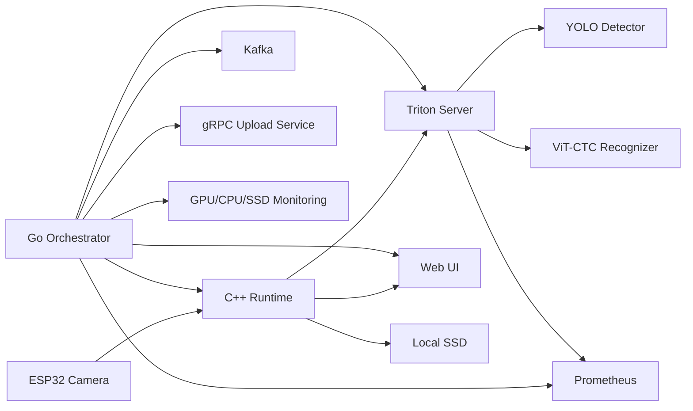
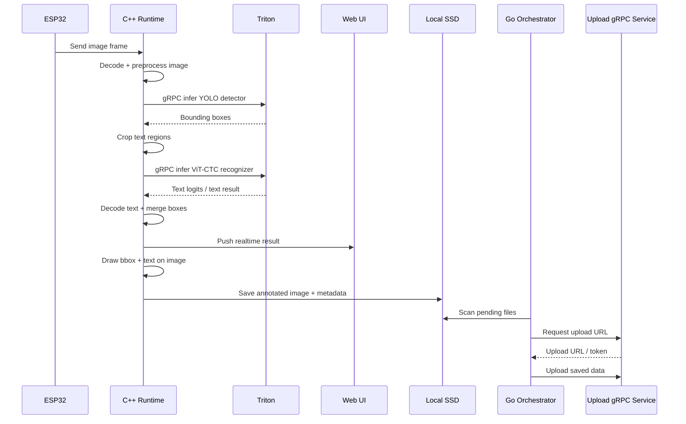
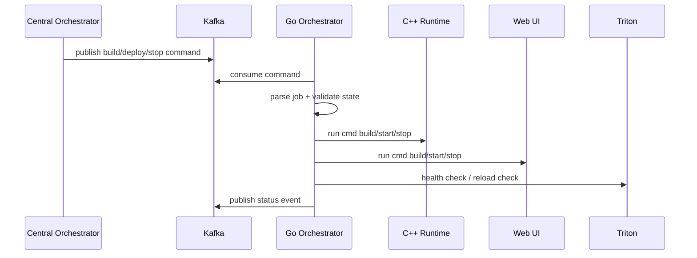

# Runtime Inference Orchestration Flow

## 1. Overview

Tài liệu này mô tả chi tiết luồng hoạt động runtime trên Jetson khi hệ thống dùng `NVIDIA Triton Inference Server` để phục vụ đồng thời 2 model:

- `Detection model`: `YOLO`
- `Recognition model`: `ViT-CTC`

Trên Jetson có 3 source chính cùng phối hợp:

- `C++ runtime`
- `Web UI`
- `Go orchestrator`

Mục tiêu của toàn bộ runtime:

- nhận ảnh từ `ESP32`
- chạy `YOLO` để tìm bounding box
- chạy `ViT-CTC` để đọc text trong vùng crop
- hiển thị kết quả realtime cho user
- lưu ảnh kết quả vào SSD
- upload dữ liệu định kỳ về backend/control-plane
- theo dõi realtime tình trạng `GPU`, `CPU`, `SSD`, `Triton`, `runtime`

Toàn bộ hệ thống được chia làm 2 lớp:

- `Data plane`: luồng inference realtime phục vụ kết quả trực tiếp
- `Control plane`: luồng điều khiển build, stop, deploy, upload, monitoring, health

Sơ đồ tổng thể:



---

## 2. Technology Map

Phần này giải thích mỗi source dùng công nghệ gì và nhìn vào công nghệ đó có thể hiểu source đó làm gì.

### 2.1. Triton Inference Server

`Triton` là model-serving runtime trung tâm.

Công nghệ chính:

- `NVIDIA Triton Inference Server`
- `TensorRT backend`
- `gRPC inference API`
- `HTTP/metrics endpoint`
- `model repository`

Vai trò:

- nạp và serve 2 model `YOLO` và `ViT-CTC`
- nhận request inference từ `C++ runtime`
- trả tensor output cho detector và recognizer
- expose metrics cho `Prometheus`
- quản lý lifecycle model theo version trong model repository

Nếu nhìn vào Triton, có thể hiểu đây là lớp:

- `model execution layer`
- `GPU inference layer`
- `serving layer`

### 2.2. C++ Runtime

`C++ runtime` là source xử lý realtime gần camera nhất.

Công nghệ chính:

- `C++`
- `OpenCV`
- `Triton gRPC C++ client` từ repo NVIDIA Triton
- `YAML config loader`
- `.env loader`
- `filesystem / SSD writer`
- có thể mở rộng bằng `prometheus-cpp` hoặc custom metrics endpoint

Vai trò:

- nhận ảnh từ `ESP32`
- preprocess ảnh trước inference
- gọi Triton detector `YOLO`
- crop vùng bbox
- gọi Triton recognizer `ViT-CTC`
- postprocess kết quả text
- ghép bbox + text + confidence
- đẩy kết quả realtime sang `Web UI`
- vẽ ảnh annotate
- lưu ảnh và metadata vào SSD để `Go orchestrator` upload định kỳ

Nếu nhìn vào C++ runtime, có thể hiểu đây là lớp:

- `realtime inference client`
- `image processing layer`
- `post-processing layer`
- `data capture layer`

### 2.3. Web UI

`Web UI` là lớp hiển thị cho user.

Công nghệ chính:

- `HTML/CSS/JavaScript` hoặc framework frontend tương đương
- `WebSocket` hoặc `HTTP polling`
- `Canvas` hoặc overlay rendering
- `image viewer / live dashboard`

Vai trò:

- nhận kết quả realtime từ `C++ runtime`
- hiển thị ảnh gốc hoặc ảnh đã annotate
- hiển thị bbox, text, confidence
- hiển thị trạng thái runtime và monitoring cơ bản
- cho user quan sát trực tiếp hệ thống đang chạy gì

Nếu nhìn vào Web UI, có thể hiểu đây là lớp:

- `presentation layer`
- `live monitoring viewer`
- `user-facing runtime dashboard`

### 2.4. Go Orchestrator

`Go orchestrator` là control-plane agent trên Jetson.

Công nghệ chính:

- `Go`
- `Kafka consumer`
- `Kafka producer`
- `os/exec` để chạy command
- `gRPC client`
- `Prometheus exporter`
- đọc metrics hệ thống từ `tegrastats`, `sysfs`, `df`, `iostat`, hoặc collector custom

Vai trò:

- nhận job từ orchestrator tổng qua `Kafka`
- chạy command build, start, stop, restart cho `C++ runtime` và `Web UI`
- quản lý deploy runtime cục bộ
- lấy upload URL bằng `gRPC client`
- quét dữ liệu đã lưu ở SSD và upload định kỳ
- scrape hoặc proxy metrics của Triton
- theo dõi realtime `GPU`, `CPU`, `SSD`
- publish trạng thái ngược về control-plane

Nếu nhìn vào Go orchestrator, có thể hiểu đây là lớp:

- `edge control-plane agent`
- `deployment agent`
- `upload scheduler`
- `system monitoring agent`

### 2.5. Kafka

`Kafka` là bus sự kiện cho control-plane.

Vai trò:

- nhận request từ orchestrator tổng
- truyền command `build`, `stop`, `deploy`, `restart`
- truyền event trạng thái `started`, `failed`, `deployed`, `upload_completed`

Nếu nhìn vào Kafka, có thể hiểu đây là lớp:

- `command/event bus`

### 2.6. gRPC Upload Service

`gRPC upload service` là dịch vụ cấp URL hoặc credential upload.

Vai trò:

- cấp upload URL cho dữ liệu từ edge
- cho phép Go orchestrator upload dữ liệu mà không hard-code đường đi storage
- kết nối control-plane và storage plane

Nếu nhìn vào gRPC upload service, có thể hiểu đây là lớp:

- `artifact upload gateway`

### 2.7. Prometheus

`Prometheus` là lớp scrape metrics.

Vai trò:

- scrape metrics từ Triton
- scrape metrics từ Go orchestrator
- có thể scrape runtime metrics của C++ nếu expose endpoint

Nếu nhìn vào Prometheus, có thể hiểu đây là lớp:

- `metrics collection layer`

---

## 3. End-to-End Data Flow

Đây là luồng inference realtime từ ảnh đầu vào đến kết quả cuối cùng.



### 3.1. Input từ ESP32

Nguồn ảnh đầu vào đến từ `ESP32`, có thể theo các kiểu:

- ảnh chụp đơn lẻ
- frame stream
- HTTP push
- RTSP hoặc một giao thức nhẹ custom

Tại thời điểm này, C++ runtime chịu trách nhiệm:

- nhận byte ảnh
- validate frame
- convert sang `cv::Mat`

### 3.2. Preprocess trong C++

`OpenCV` được dùng cho:

- decode ảnh
- resize
- normalize
- color convert
- padding nếu cần
- cắt ROI cho recognizer

Đây là lớp chuẩn bị input tensor cho Triton.

### 3.3. Detection qua YOLO

C++ runtime gửi request tới Triton bằng `Triton gRPC C++ client`.

Model `YOLO` trả về:

- bounding boxes
- score
- class id nếu có

Sau đó C++ runtime:

- lọc bbox theo threshold
- sort bbox
- cắt từng vùng cần nhận diện text

### 3.4. Recognition qua ViT-CTC

Mỗi crop ảnh text được gửi tiếp sang model `ViT-CTC`.

Recognizer trả về:

- token logits
- hoặc sequence prediction

C++ runtime sẽ:

- decode token
- chuyển thành text
- ghép text vào bbox tương ứng

### 3.5. Hậu xử lý và render

Sau khi có bbox + text:

- C++ runtime tạo object kết quả
- vẽ bbox bằng `OpenCV`
- chèn text label
- sinh ảnh annotate cuối cùng

### 3.6. Gửi realtime sang Web UI

C++ runtime đẩy dữ liệu realtime sang Web UI bằng một trong các cách:

- `WebSocket`
- `Server-Sent Events`
- `HTTP polling endpoint`

Web UI hiển thị:

- ảnh hiện tại
- bbox
- text
- confidence
- số frame đã xử lý

### 3.7. Lưu SSD

C++ runtime lưu:

- ảnh gốc nếu cần
- ảnh annotate
- JSON metadata của detection/recognition
- timestamp
- device id

Mục đích:

- audit
- retraining
- upload về backend theo định kỳ

---

## 4. Control Plane Flow

Đây là luồng điều khiển do `Go orchestrator` đảm nhận.



### 4.1. Nhận command từ orchestrator tổng

Control-plane trung tâm gửi request qua Kafka, ví dụ:

- `build_cpp_runtime`
- `start_cpp_runtime`
- `stop_cpp_runtime`
- `deploy_web_ui`
- `restart_web_ui`
- `reload_runtime_stack`

Go orchestrator là consumer của các topic/job đó.

Trong flow hoàn chỉnh của hệ thống, các topic `deploy/export` này được publish từ:

- `services/model-lifecycle-service`

Tức là edge Go orchestrator là executor ở phía edge, còn lifecycle service là nơi quyết định khi nào cần build lại artifact và deploy lại model.

### 4.2. Chạy command cho 2 source còn lại

Go orchestrator không làm inference trực tiếp.

Nó dùng `os/exec` để:

- build source `C++`
- start/stop/restart process `C++ runtime`
- build source `Web UI`
- start/stop/restart process `Web UI`

Có thể đi kèm:

- `systemd`
- shell script
- binary command trực tiếp

### 4.3. Điều phối deploy

Khi có deploy request:

1. dừng source đang chạy nếu cần
2. cập nhật config hoặc artifact
3. chạy script export TensorRT tương ứng từ source training:
   - `/home/minhtk/code/overwatch-edge-ai/worktree/backend_nexus/ml/training/scripts/export_recognizer_tensorrt.sh`
   - `/home/minhtk/code/overwatch-edge-ai/worktree/backend_nexus/ml/training/scripts/export_yolo_tensorrt.sh`
4. cập nhật artifact TensorRT mới cho `Triton`
5. khởi động lại `C++ runtime` và `Web UI`
6. kiểm tra `Triton` healthy
7. publish trạng thái thành công/thất bại

### 4.4. Upload định kỳ

Go orchestrator định kỳ:

- quét SSD
- chọn file chưa upload
- gọi `gRPC client` để lấy upload URL
- upload file
- đánh dấu trạng thái upload xong

### 4.5. Publish trạng thái ngược lại

Sau mỗi action, Go orchestrator gửi event:

- `build_started`
- `build_completed`
- `export_started`
- `export_completed`
- `export_failed`
- `deploy_started`
- `deploy_completed`
- `deploy_failed`
- `upload_completed`
- `upload_failed`

---

## 5. Monitoring Flow

Monitoring có 3 lớp:

- `Triton metrics`
- `runtime/system metrics`
- `service health metrics`

### 5.1. Triton monitoring

Triton có metrics endpoint riêng, Prometheus sẽ scrape các chỉ số như:

- request count
- queue time
- compute time
- success/error count
- model version hoạt động

Vai trò:

- biết model nào đang phục vụ
- biết latency detector/recognizer
- phát hiện lỗi inference

### 5.2. Go orchestrator monitoring

Go orchestrator có thể expose metrics như:

- service up/down
- số command đã nhận
- số job deploy thành công/thất bại
- số file upload thành công/thất bại
- thời gian upload
- số file pending trên SSD

### 5.3. GPU, CPU, SSD realtime

Go orchestrator cần theo dõi:

- `GPU usage`
- `GPU memory`
- `CPU usage`
- `RAM usage`
- `SSD used / free`
- `SSD write rate`
- `temperature`

Nguồn dữ liệu có thể đến từ:

- `tegrastats`
- `/proc`
- `/sys`
- `df`
- `iostat`
- collector custom trong Go

### 5.4. C++ runtime monitoring

Nếu muốn sâu hơn, C++ runtime có thể expose:

- fps nhận ảnh
- fps inference hoàn chỉnh
- detection latency
- recognition latency
- số bbox/frame
- số frame lỗi

### 5.5. Web UI monitoring

Web UI có thể hiển thị:

- trạng thái kết nối realtime
- frame cuối nhận được lúc nào
- model version hiện tại
- tình trạng Triton và runtime

---

## 6. Responsibility By Source

Phần này chia rất rõ từng source làm gì.

### 6.1. C++ Runtime

Làm:

- nhận ảnh từ ESP32
- preprocess bằng OpenCV
- gọi Triton qua gRPC
- hậu xử lý detection + recognition
- ghép kết quả
- gửi realtime sang Web UI
- vẽ ảnh
- lưu file vào SSD

Không làm:

- không điều phối build/deploy toàn hệ thống
- không chịu trách nhiệm upload định kỳ
- không làm registry model

### 6.2. Web UI

Làm:

- hiển thị kết quả realtime cho user
- hiển thị ảnh, bbox, text
- hiển thị thông tin runtime cơ bản

Không làm:

- không chạy inference
- không gọi Triton trực tiếp trong thiết kế chính
- không điều phối deploy

### 6.3. Go Orchestrator

Làm:

- nhận command từ Kafka
- chạy cmd cho C++ runtime và Web UI
- quản lý deploy/start/stop
- upload định kỳ dữ liệu SSD
- theo dõi monitoring hệ thống
- kết nối Prometheus/Triton metrics

Không làm:

- không xử lý ảnh realtime
- không decode bbox/text
- không render kết quả trực tiếp cho user

### 6.4. Triton

Làm:

- serve `YOLO`
- serve `ViT-CTC`
- expose inference API
- expose metrics

Không làm:

- không nhận ảnh từ ESP32 trực tiếp
- không hiển thị UI
- không upload artifact

---

## 7. Failure and Recovery

### 7.1. Triton lỗi hoặc timeout

Triệu chứng:

- C++ gọi gRPC timeout
- detector/recognizer không trả kết quả

Recovery:

- C++ runtime retry số lần giới hạn
- Go orchestrator đánh dấu Triton unhealthy
- Go orchestrator restart hoặc redeploy runtime liên quan

### 7.2. YOLO không detect được bbox

Triệu chứng:

- frame không có bounding box

Recovery:

- C++ runtime trả kết quả rỗng hợp lệ
- vẫn gửi realtime sang Web UI
- vẫn có thể lưu SSD để audit

### 7.3. Recognizer lỗi

Triệu chứng:

- có bbox nhưng không decode được text

Recovery:

- gắn trạng thái `recognition_failed`
- vẫn hiển thị bbox
- lưu metadata để phân tích sau

### 7.4. SSD đầy

Triệu chứng:

- không ghi được ảnh/JSON

Recovery:

- Go orchestrator phát hiện usage vượt ngưỡng
- dừng lưu non-critical file
- ưu tiên upload các file pending
- gửi alert về control-plane

### 7.5. Kafka mất kết nối

Triệu chứng:

- Go orchestrator không nhận được command mới
- không publish được status

Recovery:

- retry reconnect
- queue local status tạm thời nếu cần
- không làm chết data plane nếu inference vẫn đang chạy

### 7.6. gRPC upload service lỗi

Triệu chứng:

- không lấy được upload URL

Recovery:

- Go orchestrator giữ file trên SSD
- retry theo backoff
- đánh dấu file pending

### 7.7. Web UI mất kết nối realtime

Triệu chứng:

- user không thấy ảnh mới

Recovery:

- tự reconnect
- hiển thị trạng thái stale
- inference backend vẫn tiếp tục chạy

---

## 8. Suggested Runtime Layout On Jetson

Đây là layout process/service gợi ý cho Jetson.

```text
edge/jetson/
  runtime-inference-orchestration-flow.md
  triton/
    model_repository/
      detection_yolo/
      recognizer_vit_ctc/
  cpp-runtime/
    bin/
    config/
      runtime.yaml
      .env
    data/
      pending/
      uploaded/
      failed/
    logs/
  web-ui/
    dist/
    config/
  go-orchestrator/
    bin/
    config/
    logs/
```

### 8.1. Process gợi ý

- `triton-server`
- `cpp-inference-runtime`
- `web-ui-server`
- `edge-go-orchestrator`
- `prometheus-agent` hoặc external scrape target

### 8.2. Quan hệ giữa các process

- `triton-server` chạy model
- `cpp-inference-runtime` phụ thuộc `triton-server`
- `web-ui-server` phụ thuộc stream dữ liệu từ `cpp-inference-runtime`
- `edge-go-orchestrator` điều khiển `cpp-inference-runtime` và `web-ui-server`

Ngoài ra:

- `edge-go-orchestrator` nhận topic `deploy/export` từ `services/model-lifecycle-service`
- khi nhận topic phù hợp, nó chạy script export TensorRT nằm trong `ml/training/scripts`
- artifact TensorRT mới sau đó được nạp lại vào `Triton`

### 8.3. Cấu hình C++ runtime

Nguồn config:

- `runtime.yaml`
- `.env`

Nội dung nên có:

- địa chỉ Triton gRPC
- threshold detector
- timeout recognizer
- đường dẫn SSD
- cấu hình stream ESP32
- endpoint Web UI push

### 8.4. Cấu hình Go orchestrator

Nội dung nên có:

- Kafka bootstrap server
- topic command/status
- topic deploy/export nhận từ `services/model-lifecycle-service`
- gRPC upload endpoint
- scan interval SSD
- metric scrape interval
- command path để start/stop build runtime
- command path để chạy:
  - `export_recognizer_tensorrt.sh`
  - `export_yolo_tensorrt.sh`

### 8.5. Cấu hình Web UI

Nội dung nên có:

- endpoint realtime data
- refresh strategy
- overlay enable/disable
- panel monitoring URL

### 8.6. Kết luận thực thi

Mô hình tổng quát của hệ này là:

- `Triton` làm inference serving
- `C++ runtime` làm realtime image pipeline
- `Web UI` làm lớp hiển thị
- `Go orchestrator` làm edge control-plane agent

Đây là cách tách trách nhiệm rõ nhất để:

- inference không bị trộn với deploy logic
- UI không bị trộn với xử lý ảnh
- upload/monitoring không làm chậm luồng realtime
- hệ thống dễ scale và dễ debug hơn trên Jetson
