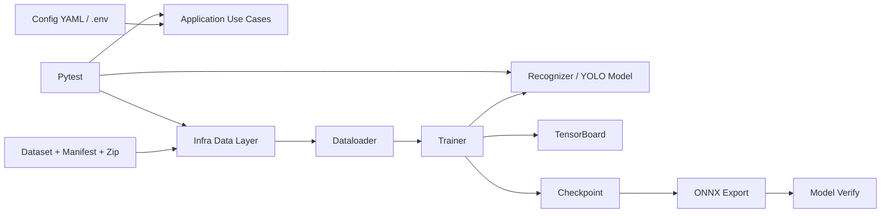
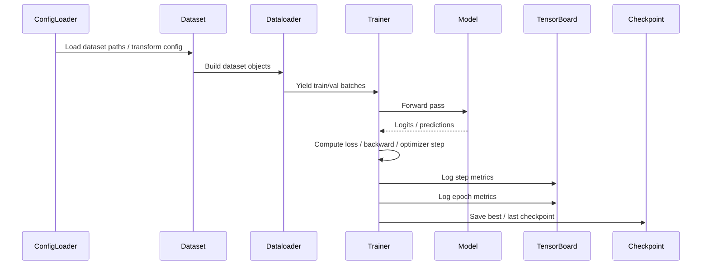
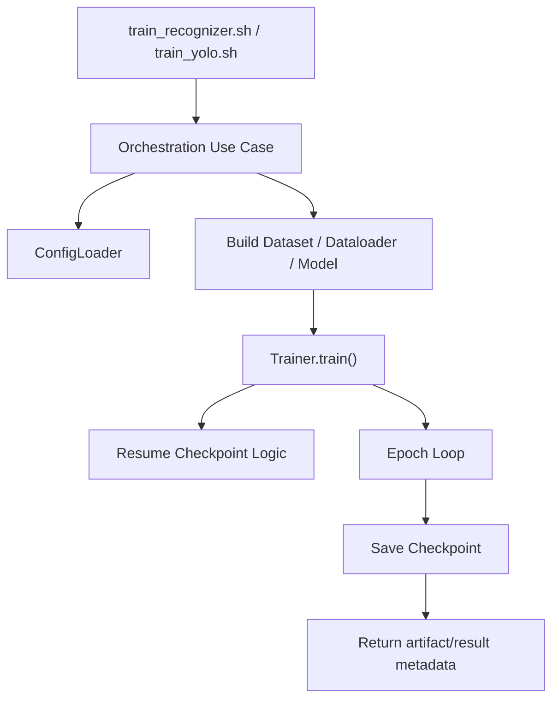

# Training Source Flow

## 1. Overview

Tài liệu này mô tả chi tiết source `ml/training` như một subsystem hoàn chỉnh cho quá trình:

- huấn luyện model `recognizer`
- huấn luyện model `detection`
- quản lý config, dataset, dataloader, transform
- log metric bằng `TensorBoard`
- lưu checkpoint để resume
- export model sang `ONNX`
- xác minh model sau export

Source này đã hoàn thiện theo hướng:

- tách lớp `application`, `domain`, `infra`, `modeling`
- hỗ trợ ít nhất 2 pipeline chính:
  - `Recognizer training`
  - `YOLO detection training`
- có script shell để train/export
- có test cho nhiều phần lõi

Mục tiêu của source `ml/training`:

- biến dữ liệu train thành checkpoint model
- theo dõi metric train/val
- hỗ trợ resume training
- chuẩn bị artifact phục vụ inference runtime hoặc deploy tiếp theo

Sơ đồ tổng thể:



Source này chia làm 4 luồng chính:

- `config flow`
- `training flow`
- `artifact flow`
- `validation flow`

---

## 2. Technology Map

Phần này giải thích mỗi nhóm công nghệ trong `ml/training` dùng để làm gì.

### 2.1. Core runtime và framework

Công nghệ chính:

- `Python 3.13`
- `PyTorch`
- `torchvision`
- `torchaudio`
- `tqdm`

Vai trò:

- xây model
- train model
- chạy optimizer / scheduler
- quản lý tensor, autograd, mixed precision
- hiển thị tiến trình train

Nếu nhìn vào nhóm này, có thể hiểu đây là:

- `training execution layer`
- `deep learning framework layer`

### 2.2. Data và preprocessing

Công nghệ chính:

- `OpenCV`
- custom dataset/dataloader trong `src/infra/data`
- custom transform cho recognizer
- YAML/manifest dataset

Vai trò:

- đọc dữ liệu train/val/test
- transform ảnh đầu vào
- build dataloader theo config
- chuẩn hóa format dữ liệu cho recognizer và detector

Nếu nhìn vào nhóm này, có thể hiểu đây là:

- `data ingestion layer`
- `preprocessing layer`

### 2.3. Recognizer stack

Công nghệ và module chính:

- `VisionTransformers`
- `MobileNetBackBone`
- `MultiLatentAttention`
- `DeepSeekMOE`
- `RecognizerCTCModel`
- `CTCLabelEncoder`

Vai trò:

- định nghĩa mô hình OCR recognizer
- encode ảnh text line
- sinh logits cho CTC decoding
- hỗ trợ vocab và label encoding

Nếu nhìn vào nhóm này, có thể hiểu đây là:

- `ocr recognizer modeling layer`

### 2.4. Detection stack

Công nghệ chính:

- `Ultralytics YOLO`
- `YoloTrainer`

Vai trò:

- train detector text bounding box
- quản lý weights/best.pt/last.pt
- phục vụ nhánh detection riêng

Nếu nhìn vào nhóm này, có thể hiểu đây là:

- `text detection training layer`

### 2.5. Tracking và observability

Công nghệ chính:

- `TensorBoard`
- `MLflow` dependency đã có trong source
- custom hooks

Hook chính đã thấy trong repo:

- `TensorBoardScalarHook`
- `NaNInfGuardHook`
- `GradNormHook`

Vai trò:

- log step/epoch metrics
- log learning rate
- log signal phát hiện NaN/Inf
- log gradient norm
- hỗ trợ theo dõi training behavior

Nếu nhìn vào nhóm này, có thể hiểu đây là:

- `training observability layer`

### 2.6. Export và verify

Công nghệ chính:

- `ONNX`
- `onnxruntime`
- `torch.onnx.export`
- script export shell
- script verify model

Vai trò:

- chuyển checkpoint sang `ONNX`
- kiểm tra model export có chạy được không
- chuẩn bị artifact cho inference runtime

Nếu nhìn vào nhóm này, có thể hiểu đây là:

- `deployment artifact preparation layer`

### 2.7. Testing và quality

Công nghệ chính:

- `pytest`
- `ruff`

Vai trò:

- test model logic
- test dataloader, dataset, transform
- test training orchestration
- giảm rủi ro khi refactor

Nếu nhìn vào nhóm này, có thể hiểu đây là:

- `quality assurance layer`

---

## 3. Training Data Flow

Đây là luồng dữ liệu từ config và dataset đến model output trong quá trình train.



### 3.1. Config vào hệ thống

Recognizer lấy config từ:

- `config/training/recognizer_ctc.yaml`
- `.env.example` và biến môi trường tương ứng

YOLO lấy config từ:

- `config/training/yolo/config.yaml`
- `config/training/yolo/config.yaml.local`
- `config/training/yolo/config.json`

Các config này quyết định:

- dataset path
- split train/val
- transform
- batch size
- optimizer
- scheduler
- hooks
- save dir
- tensorboard dir

### 3.2. Dataset loading

Nhánh recognizer có:

- dataset recognizer
- label encoder CTC
- dataloader build use case

Nhánh detection có:

- dataset theo format YOLO
- `data.yaml`
- train/val/test directory

Mục tiêu là chuẩn hóa dữ liệu đầu vào về format mà trainer và model có thể tiêu thụ trực tiếp.

### 3.3. Transform và preprocess

Nhánh recognizer có transform rõ hơn:

- brightness
- contrast
- saturation
- hue
- grayscale probability
- blur
- affine
- normalize mean/std

Việc transform giúp:

- tăng robustness
- mô phỏng biến thiên ánh sáng, blur, lệch góc
- ổn định train OCR

### 3.4. Batching

Dataloader chịu trách nhiệm:

- batch size
- shuffle
- num_workers
- pin_memory
- drop_last
- persistent_workers

Riêng recognizer còn cần:

- collate cho sequence length
- encode text label sang token cho CTC

### 3.5. Forward và loss

Recognizer:

- forward qua `RecognizerCTCModel`
- sinh logits
- tính `ctc_loss`
- có thêm `aux_loss`

Detection:

- forward qua `YOLO`
- loss do trainer YOLO/Ultralytics quản lý

### 3.6. Step metrics và epoch metrics

Trainer log 2 cấp:

- `step metrics`
- `epoch metrics`

Ví dụ recognizer:

- `step_loss`
- `step_ctc_loss`
- `step_aux_loss`
- `step_cer`
- `step_wer`
- `step_seq_acc`

Và ở epoch:

- `epoch_loss`
- `epoch_ctc_loss`
- `epoch_aux_loss`
- `epoch_cer`
- `epoch_wer`
- `epoch_seq_acc`
- `epoch_pred_non_blank_ratio`
- `epoch_pred_avg_length`
- `epoch_gt_avg_length`

### 3.7. Checkpoint output

Trainer sẽ lưu:

- `last_checkpoint.pt`
- `best_loss.pt`
- `best_cer.pt`

Checkpoint chứa:

- `model_state_dict`
- `optimizer_state_dict`
- `scheduler_state_dict`
- `scaler_state_dict`
- `epoch`
- `epoch_idx`
- `best_val_loss`
- `best_val_cer`
- `encoder_vocab`
- `encoder_num_classes`

---

## 4. Training Control Flow

Đây là luồng điều khiển ở mức use case và orchestration.



### 4.1. Shell script entrypoint

Script chính:

- `scripts/train_recognizer.sh`
- `scripts/train_yolo.sh`

Vai trò:

- set mode chạy
- gọi Python module orchestration
- chuẩn hóa cách launch training

### 4.2. Orchestration use case

Nhánh recognizer có `train_recognizer_orchestration`.

Nó chịu trách nhiệm:

- load config
- resolve vocab
- build dataloader
- build model
- build optimizer
- gọi trainer
- trả kết quả cuối cùng

### 4.3. Resume checkpoint

Trainer có logic:

- tìm checkpoint resume
- load state model
- load optimizer state
- load scheduler state
- load scaler state nếu có
- xác định epoch bắt đầu tiếp theo

Ý nghĩa:

- không mất tiến trình train khi dừng giữa chừng
- cho phép train dài ngày

### 4.4. Scheduler và optimizer control

Trainer quản lý:

- `AdamW` hoặc optimizer phù hợp
- `grad_accum_steps`
- AMP nếu dùng CUDA
- LR scheduler

Điểm quan trọng là control flow này tách khỏi model definition, nghĩa là model không tự quản lý vòng train.

### 4.5. Hooks control

Hooks được bật/tắt theo config:

- TensorBoard hook
- NaN/Inf guard
- Grad norm hook

Điều này giúp hệ thống:

- quan sát tốt hơn
- tránh NaN âm thầm phá training
- debug gradient behavior

### 4.6. Return result

Sau train, orchestration trả về metadata như:

- dataset size
- train/val size
- đường dẫn best checkpoint
- đường dẫn last checkpoint

Thông tin này rất quan trọng cho pipeline sau:

- export
- MLflow
- deploy

---

## 5. Observability And Artifacts

### 5.1. TensorBoard

Recognizer training đã gắn khá nhiều metric vào TensorBoard.

TensorBoard là nguồn chính để:

- đọc diễn biến train/val
- xem step loss
- xem epoch loss
- kiểm tra lr
- phân tích CER/WER/seq_acc

### 5.2. Checkpoint artifacts

Artifact quan trọng nhất của source này là checkpoint.

Chúng được dùng để:

- resume training
- đánh giá best model
- export sang ONNX
- import vào MLflow

### 5.3. Dataset artifacts

Source hiện có:

- `recognizer.zip`
- `detection.zip`
- dataset manifest
- `god_dataset_*` subset

Vai trò:

- phục vụ train thật
- phục vụ smoke / subset / long-run test
- tạo lineage dữ liệu

### 5.4. Export artifacts

Sau khi train xong có thể tạo:

- `recognizer.onnx`
- TensorRT engine ở flow tiếp theo
- YOLO export artifact

### 5.5. Verify artifacts

Source có phần verify model export:

- load model đã export
- chạy kiểm tra inference tối thiểu
- đảm bảo artifact không bị hỏng logic cơ bản

### 5.6. MLflow position

`mlflow` đã có trong dependency nhưng source hiện đang dùng `TensorBoard` là tracking trực tiếp rõ nhất.

Nghĩa là:

- source này đã sẵn sàng cho việc nối thêm MLflow
- nhưng core training flow hiện tại không phụ thuộc bắt buộc vào MLflow

---

## 6. Responsibility By Layer

### 6.1. `src/application`

Làm:

- orchestration
- training use case
- build dataloader use case
- load model use case

Không làm:

- không chứa implementation hạ tầng thấp nhất
- không nên chứa logic tensor/image chi tiết

### 6.2. `src/domain`

Làm:

- định nghĩa contract / port / value object
- giữ boundary của config và abstraction

Không làm:

- không train trực tiếp
- không phụ thuộc framework cụ thể quá sâu nếu tránh được

### 6.3. `src/infra`

Làm:

- dataset implementation
- dataloader implementation
- transform implementation
- hooks
- YOLO trainer wrapper
- ONNX export / verify

Không làm:

- không nên quyết định business flow orchestration

### 6.4. `src/modeling`

Làm:

- chứa implementation model components
- backbone
- transformer
- attention
- MoE

Không làm:

- không điều phối train loop
- không quản lý artifact lifecycle

### 6.5. `tests`

Làm:

- test từng lớp nhỏ
- test orchestration
- test trainer long-run / resume

Không làm:

- không thay thế monitoring runtime thật

---

## 7. Failure And Recovery

### 7.1. Config sai hoặc thiếu env

Triệu chứng:

- không load được config
- placeholder env bị thiếu

Recovery:

- kiểm tra `.env.example`
- validate config sớm
- fail-fast trước khi vào train loop

### 7.2. Dataset path sai hoặc dữ liệu lỗi

Triệu chứng:

- dataset không tồn tại
- ảnh hỏng
- label thiếu

Recovery:

- validate từ dataset constructor
- dùng manifest để kiểm tra trước
- ghi rõ sample lỗi

### 7.3. Dataloader lỗi batching

Triệu chứng:

- collate fail
- batch shape không đúng

Recovery:

- test riêng dataloader/collate
- log shape ở bước đầu train

### 7.4. NaN/Inf trong training

Triệu chứng:

- loss trở thành NaN
- grad explode

Recovery:

- bật `NaNInfGuardHook`
- dùng grad clip
- giảm learning rate
- kiểm tra transform hoặc label encode

### 7.5. Checkpoint incompatible

Triệu chứng:

- resume không load được state dict

Recovery:

- skip checkpoint lỗi
- cảnh báo trong log
- fallback train từ đầu nếu cần

### 7.6. Export ONNX lỗi

Triệu chứng:

- torch.onnx.export fail
- verify runtime fail

Recovery:

- kiểm tra input shape
- kiểm tra opset
- verify với `onnxruntime`

### 7.7. Metric tracking không đúng

Triệu chứng:

- step/epoch bị log lẫn
- TensorBoard không phản ánh đúng training stage

Recovery:

- tách rõ step metrics và epoch metrics
- đối chiếu lại trainer loop
- dùng test hoặc script import để xác minh

---

## 8. Suggested Source Layout

Source hiện tại đã tương đối rõ vai trò và có thể hiểu theo layout logic sau:

```text
ml/training/
  config/
    .env.example
    training/
      recognizer_ctc.yaml
      yolo/
        config.yaml
        config.yaml.local
        config.json
  data/
    recognizer/
    detection/
    *.zip
    *_manifest.json
  scripts/
    train_recognizer.sh
    train_yolo.sh
    export_recognizer_tensorrt.sh
    export_yolo_tensorrt.sh
  src/
    application/
    domain/
    infra/
    modeling/
    utils/
  tests/
  training-source-flow.md
```

### 8.1. Ý nghĩa layout

- `config/`: nơi khai báo cấu hình train
- `data/`: dữ liệu và artifact dataset
- `scripts/`: entrypoint thực thi thực tế
- `src/`: mã nguồn chính
- `tests/`: kiểm thử

### 8.2. Cách đọc source nhanh

Nếu muốn hiểu source này nhanh nhất, nên đọc theo thứ tự:

1. `config/training/recognizer_ctc.yaml`
2. `scripts/train_recognizer.sh`
3. `src/application/use_cases/orchestration/train_recognizer_orchestration.py`
4. `src/application/use_cases/recognizer/trainer.py`
5. `src/infra/data/*`
6. `src/modeling/recognizer/*`
7. `src/infra/onnx/*`

Nhánh YOLO nên đọc theo thứ tự:

1. `config/training/yolo/config.yaml`
2. `scripts/train_yolo.sh`
3. `src/infra/modeling/detection/yolo.py`
4. `scripts/export_yolo_tensorrt.sh`

### 8.3. Kết luận thực thi

Source `ml/training` đóng vai trò là:

- `training factory`
- `artifact producer`
- `checkpoint producer`
- `export preparation source`

Nó không phải là runtime inference source.

Nó tạo ra:

- checkpoint tốt nhất
- metric train/val
- artifact export

để các source downstream như:

- `edge runtime`
- `Triton serving`
- `MLflow tracking`
- `model lifecycle orchestration`

tiếp tục sử dụng.
