# Model Lifecycle Orchestrator Flow

Tài liệu này cập nhật theo source hiện tại dưới `services/model-lifecycle-service/src`, nhưng vẫn giữ góc nhìn kiến trúc đầy đủ của orchestrator thay vì chỉ mô tả những phần đã implement xong 100%.

Nguyên tắc đọc tài liệu này:

- phần nào đã có trong `src/` sẽ ghi là `current source`
- phần nào là hướng kiến trúc hoặc workflow đang hoàn thiện dần sẽ ghi là `target / intended flow`
- không xem phần chưa hoàn tất là "không tồn tại", mà xem là capability đang được ghép dần vào runtime hiện tại

---

## 1. Overview

Source `services/model-lifecycle-service` là orchestrator cho vòng đời AI trong hệ thống.

Vai trò chính của source này không phải train model lõi trực tiếp, cũng không phải inference runtime cuối cùng, mà là điều phối các bước lifecycle:

- nhận command qua `Kafka`
- quản lý trạng thái job bằng `SQL`
- chuẩn bị dataset theo format mà downstream training cần
- gọi workflow training hoặc export tương ứng
- theo dõi artifact, tracking, download, export
- dùng OCR mạnh hơn để xử lý dữ liệu continual learning
- phát tín hiệu kết quả cho downstream stage khác
- làm control-plane cho các worker xử lý bất đồng bộ

Nói ngắn gọn, source này là:

- `AI lifecycle orchestrator`
- `training artifact coordinator`
- `dataset lifecycle coordinator`
- `event-driven control plane`
- `SQL-backed worker runtime`

Các luồng lớn mà source này bao phủ về mặt nghiệp vụ:

1. `Training flow`
2. `Dataset shaping flow`
3. `Continual learning / strong OCR assisted flow`
4. `Monitoring / MLflow / artifact flow`
5. `Model download flow`
6. `Export / deployment preparation flow`
7. `Future evaluation / deploy signaling flow`

Các thành phần hạ tầng chính hiện diện trong source hoặc được source này kết nối tới:

- `Kafka`
- `Postgres SQL`
- `MLflow`
- `Google Vision OCR`
- `ml/training`
- object storage / artifact storage integration
- edge deployment ecosystem
- monitoring / observability

Sơ đồ tổng thể nên hiểu theo 2 lớp: runtime hiện tại và target orchestration lớn hơn.

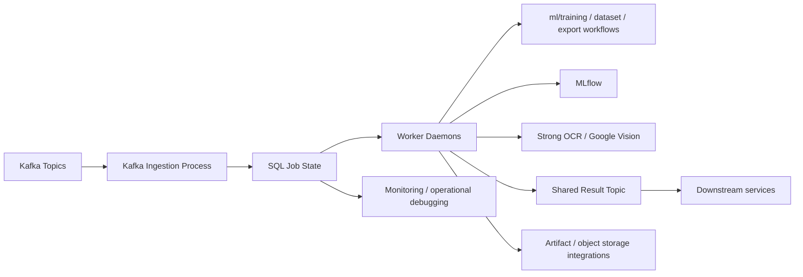

Phần quan trọng:

- runtime hiện tại đã rõ theo mô hình `Kafka ingestion -> SQL -> worker daemons`
- nhiều capability kiến trúc cũ như evaluation / deploy chain vẫn có giá trị mô tả, nhưng hiện chưa phải runtime chain đầy đủ trong `src/`

---

## 2. Reading Model For This Document

Để tránh hiểu sai giữa "source hiện tại" và "kiến trúc mục tiêu", tài liệu này dùng 3 mức mô tả:

### 2.1. Current source

Đây là những gì đang phản ánh trực tiếp trong `services/model-lifecycle-service/src`:

- `src/bootstrap/container.py` gom bootstrap dùng chung
- `src/entrypoints/kafka_ingestion/main.py` ingest Kafka vào SQL
- các worker daemon claim job từ SQL theo `event_type`
- `modules/job_control` quản lý state machine job
- success event được publish qua shared publisher
- stale `PROCESSING` jobs có reclaim timeout theo config

### 2.2. Intended runtime direction

Đây là những flow mà source đang hướng tới hoặc đã có dấu vết thiết kế, nhưng chưa phải lúc nào cũng khép kín end-to-end ở runtime hiện tại:

- lifecycle nhiều phase nối nhau bằng event
- downstream evaluation gate
- deploy signaling cho edge
- lineage artifact đầy đủ hơn qua object storage + MLflow + deployment stage

### 2.3. Legacy wording kept for context

Một số thuật ngữ cũ trong tài liệu lịch sử vẫn được giữ lại nếu chúng còn hữu ích để hiểu ý đồ hệ thống:

- `gold_data`
- `pseudo-label`
- `evaluation_requested`
- `deploy_requested`

Nhưng chúng phải được đọc như:

- capability / design intent
- hoặc flow liên quan hệ thống lớn hơn

chứ không mặc định là entrypoint đang chạy trực tiếp trong `src/` hôm nay.

---

## 3. Technology Map

Phần này mô tả công nghệ dùng trong source và nhìn vào đó có thể hiểu source này đang đóng vai gì trong hệ thống.

### 3.1. Python service layer

Công nghệ chính:

- `Python`
- `asyncio`
- `argparse`
- structured modules trong `src/`

Vai trò:

- tổ chức orchestration theo process/worker
- load config và wire dependency
- chạy polling workers
- gọi service khác
- ghép logic lifecycle cho training, artifact, dataset, continual learning, export

Nếu nhìn vào phần này, có thể hiểu đây là:

- `application orchestration layer`
- `worker runtime layer`

### 3.2. Kafka layer

Công nghệ chính:

- `confluent-kafka`
- custom consumer/producer wrapper trong `src/platform/messaging/kafka`
- topic routing theo job payload

Vai trò:

- nhận command từ upstream orchestrator
- ingest event vào SQL state
- publish success event sau khi worker hoàn tất
- làm bus giao tiếp bất đồng bộ giữa model-lifecycle-service và hệ khác

Nếu nhìn vào Kafka layer, có thể hiểu đây là:

- `event bus`
- `async workflow trigger layer`

Điểm cập nhật theo source hiện tại:

- worker daemon hiện tại không consume request Kafka trực tiếp
- request Kafka đi vào `kafka_ingestion`
- sau đó job được claim từ SQL bởi worker daemon

### 3.3. SQL state layer

Công nghệ chính:

- `asyncpg`
- `PostgresPool`
- `PostgresTransaction`
- repository/query layer trong `modules/job_control/.../postgres`

Vai trò:

- lưu trạng thái realtime của job
- lưu request đã nhận
- lưu job `RECEIVED`, `PROCESSING`, `PROCESSED`, `FAILED`
- giúp kiểm tra realtime dễ hơn thay vì chỉ đọc Kafka stream
- làm coordination point giữa ingestion process và worker daemons

Nếu nhìn vào SQL layer, có thể hiểu đây là:

- `workflow state persistence layer`
- `worker coordination layer`

### 3.4. Bootstrap and DI layer

Thành phần chính:

- `src/bootstrap/container.py`
- `src/bootstrap/__init__.py`

Vai trò:

- load config từ `.env` và yaml
- tạo `KafkaConfig`, `PostgresConfig`, `JobControlConfig`
- khởi động `PostgresPool`
- build shared success-event publisher
- resolve reclaim timeout theo từng loại job
- gom shutdown behavior dùng chung cho worker

Nếu nhìn vào lớp này, có thể hiểu đây là:

- `shared daemon bootstrap layer`
- `dependency wiring layer`

### 3.5. MLflow layer

Công nghệ chính:

- `mlflow`
- workflow tracking trong `modules/tracking`

Vai trò:

- theo dõi run detection/recognizer
- ghi metric / artifact / metadata
- làm tracking center cho model lifecycle
- hỗ trợ downstream download / registry / artifact resolution

Nếu nhìn vào MLflow layer, có thể hiểu đây là:

- `experiment tracking layer`
- `model artifact metadata layer`

### 3.6. OCR / vision integration layer

Công nghệ chính:

- `google.cloud.vision`
- adapter tại `src/platform/vision/google_ocr.py`

Vai trò:

- hỗ trợ continual learning workflow
- đọc raw image và tạo sample cho downstream dataset/training
- đóng vai strong-model assist cho việc tái cấu trúc dữ liệu

Nếu nhìn vào lớp này, có thể hiểu đây là:

- `strong OCR assisted data curation layer`

### 3.7. Dataset shaping layer

Hiện tại capability này nằm chủ yếu trong:

- `src/modules/dataset`
- `src/modules/continual_learning`

Vai trò:

- build detection/recognizer dataset
- tạo output tương thích với `ml/training`
- chuẩn hóa input format thay vì chỉ lưu dữ liệu thô
- ghép dữ liệu continual learning vào cấu trúc dataset có thể train tiếp

Nếu nhìn vào dataset shaping layer, có thể hiểu đây là:

- `dataset curation layer`
- `training-input normalization layer`

### 3.8. Worker/process layer

Entrypoints đã thấy trong source hiện tại:

- `src/entrypoints/kafka_ingestion/main.py`
- `src/entrypoints/training_daemon/main.py`
- `src/entrypoints/dataset_daemon/main.py`
- `src/entrypoints/continual_learning_daemon/main.py`
- `src/entrypoints/mlflow_tracking_daemon/main.py`
- `src/entrypoints/mlflow_download_daemon/main.py`
- `src/entrypoints/export_onnx_daemon/main.py`

Vai trò:

- phân vai giữa ingestion và execution
- tách Kafka consume khỏi business execution
- cho mỗi domain một worker daemon rõ ràng
- cho phép restart/reclaim job theo SQL state

Nếu nhìn vào nhóm này, có thể hiểu đây là:

- `process topology layer`
- `worker isolation layer`

### 3.9. Monitoring and operational layer

Source hiện tại thể hiện nhu cầu observability qua:

- log theo request/job
- SQL state transitions
- reclaim timeout theo config
- shutdown handling để tránh bỏ dở job

Monitoring metrics kiểu Prometheus có thể chưa đầy đủ trong source hiện tại, nhưng về mặt vận hành đây vẫn là:

- `operational observability layer`

---

## 4. Current Runtime Topology

Đây là topology runtime phản ánh trực tiếp source hiện tại.

### 4.1. Ingestion process

Entrypoint:

- `src/entrypoints/kafka_ingestion/main.py`

Vai trò:

- subscribe Kafka request topics
- parse/decode payload
- validate event type phù hợp
- insert job record vào bảng `kafka_events`
- commit offset sau khi ingest thành công

Điểm quan trọng:

- ingestion process không xử lý business dài hạn
- nó chỉ nhận request và đưa request vào SQL job state

### 4.2. Worker daemons

Entrypoints:

- `training_daemon/main.py`
- `dataset_daemon/main.py`
- `continual_learning_daemon/main.py`
- `mlflow_tracking_daemon/main.py`
- `mlflow_download_daemon/main.py`
- `export_onnx_daemon/main.py`

Vai trò:

- poll bảng `kafka_events`
- claim job theo `event_type`
- chuyển job sang `PROCESSING`
- gọi handler business tương ứng
- cập nhật `PROCESSED` hoặc `FAILED`
- publish success event vào topic dùng chung

Điểm quan trọng:

- worker không tiêu thụ Kafka request trực tiếp
- worker chia sẻ bootstrap/container chung
- worker có reclaim timeout để nhận lại stale job

### 4.3. Shared bootstrap runtime

Shared bootstrap nằm ở:

- `src/bootstrap/container.py`

Những gì bootstrap đang gom:

- config loading
- Postgres runtime startup
- Kafka producer cho success event
- signal handling
- shutdown orchestration
- reclaim timeout resolution

Điều này thay đổi cách hiểu cũ của source:

- trước đây có xu hướng mỗi daemon tự wire logic riêng
- hiện tại bootstrap đang dần trở thành điểm tập trung runtime contract dùng chung

### 4.4. Runtime topology diagram

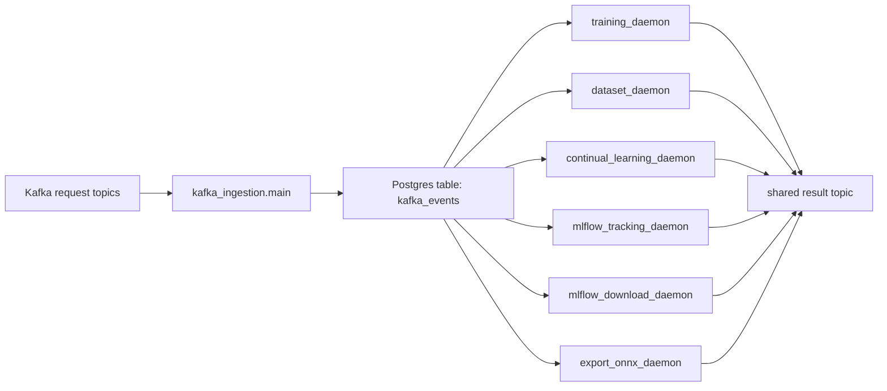

---

## 5. End-to-End Lifecycle Flow

Phần này mô tả end-to-end flow theo 2 lớp:

- `current source flow`
- `target lifecycle intent`

### 5.1. Current source flow

Luồng hiện tại đang đúng nhất là:

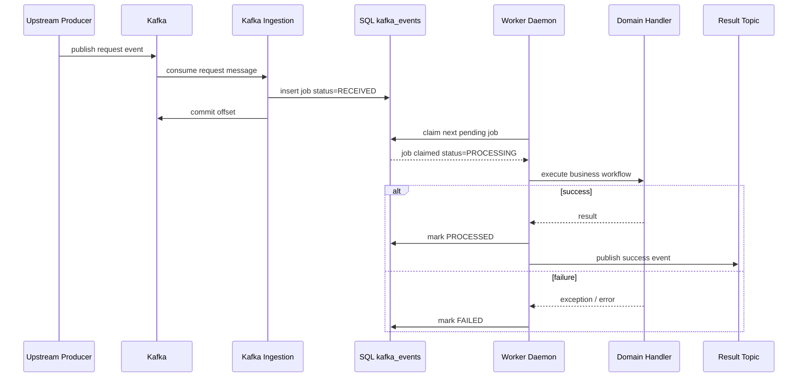

### 5.2. Target lifecycle intent

Nếu nhìn ở mức hệ thống lớn hơn, source này vẫn đang được thiết kế để trở thành điểm nối của các phase lifecycle:

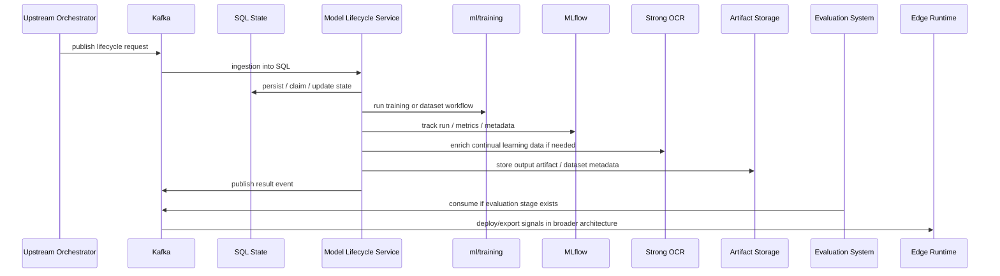

### 5.3. Event-driven AI lifecycle

Source này không chạy theo một command đồng bộ duy nhất.

Thay vào đó, các phase được nối bằng:

- `Kafka topic`
- `SQL state`
- `worker riêng`

Điều này giúp:

- dễ scale
- dễ retry
- dễ quan sát
- dễ tách lỗi theo từng phase
- tránh một process ôm toàn bộ lifecycle

### 5.4. Source tương quan với các source khác

Source này phụ thuộc hoặc gắn chặt với:

- `ml/training`
- `MLflow`
- object storage / artifact transfer layer
- OCR provider
- downstream evaluation/deploy ecosystem

Nó là lớp nằm giữa:

- upstream command producer
- training source
- tracking/artifact storage
- downstream runtime/deployment chain

---

## 6. Kafka-Driven Workflow Stages

Phần này mô tả các flow nghiệp vụ lớn mà service bao phủ. Một số flow đã có runtime rõ trong source hiện tại, một số flow là intended chain ở mức hệ thống.

### 6.1. Stage 0: Ingestion flow

Đây là stage mới cần đặt lên trước mọi stage cũ, vì source hiện tại đã tách ingestion thành process riêng.

1. upstream publish request event vào Kafka
2. `kafka_ingestion.main` consume message
3. event được validate
4. job record được insert vào `kafka_events`
5. trạng thái ban đầu là `RECEIVED`
6. Kafka offset chỉ commit sau khi ingest thành công

Sơ đồ:

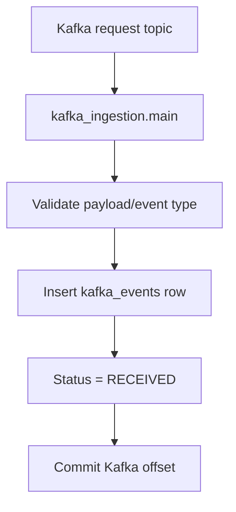

Vai trò của stage này:

- làm buffer giữa upstream event stream và business processing
- tách lỗi ingestion khỏi lỗi xử lý dài hạn
- cho phép worker daemon restart độc lập

### 6.2. Stage 1: Training flow

Current source:

- flow này chạy qua `training_daemon`
- worker claim training job từ SQL
- route theo detection/recognizer
- gọi use case trong `modules/training`

Target business intent:

1. source nhận command training
2. ghi trạng thái job vào SQL
3. chuẩn bị input dataset đúng format training
4. chọn workflow train tương ứng
5. chạy training
6. thu output:
   - checkpoint
   - tensorboard logs hoặc training logs
   - metadata
7. mark job thành công
8. publish success event cho downstream stage

Sơ đồ:

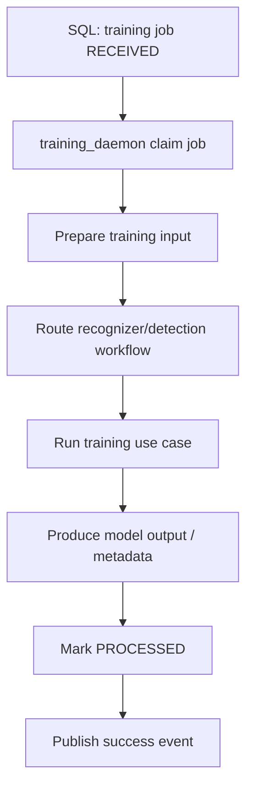

Vai trò của stage này:

- bridge giữa orchestration layer và training workflow
- đảm bảo `ml/training` nhận đúng data layout
- chuẩn hóa lifecycle state đầu ra cho các phase sau

### 6.3. Stage 2: Dataset shaping flow

Current source:

- `dataset_daemon` claim `dataset_requested_*`
- business nằm trong `modules/dataset`
- output được chỉnh theo format phục vụ downstream training

Target business intent:

1. nhận request tạo dataset hoặc reshape dataset
2. load input data từ source tương ứng
3. tạo detection/recognizer dataset
4. ghi output đúng cấu trúc mà training pipeline chờ
5. persist trạng thái job
6. publish success event

Sơ đồ:

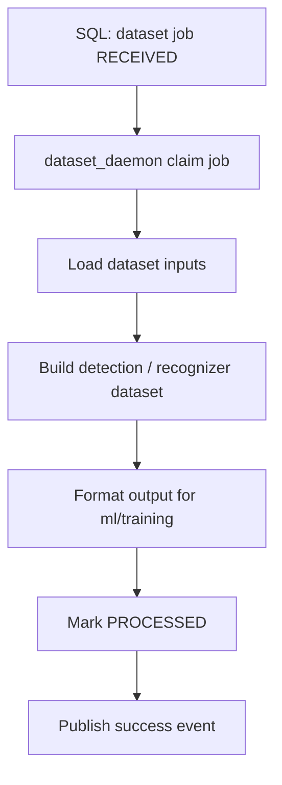

Vai trò của stage này:

- chuẩn hóa dataset layout
- tách dataset shaping ra khỏi training execution
- giảm coupling giữa request payload và training filesystem layout

### 6.4. Stage 3: Continual learning / strong OCR flow

Current source:

- `continual_learning_daemon` claim `continual_learning_requested`
- `modules/continual_learning` xử lý raw image
- `GoogleVisionOCR` được dùng như strong OCR integration
- output recognizer đã được chỉnh để tương thích format `ml/training/data/recognizer`

Target business intent:

1. lấy raw image hoặc failed sample cần tái xử lý
2. gửi ảnh tới OCR mạnh hơn
3. nhận pseudo label / text extraction / box extraction
4. biến kết quả thành sample detection/recognizer có thể train tiếp
5. ghi dữ liệu processed ra output directory
6. cập nhật trạng thái job và phát event thành công

Sơ đồ:

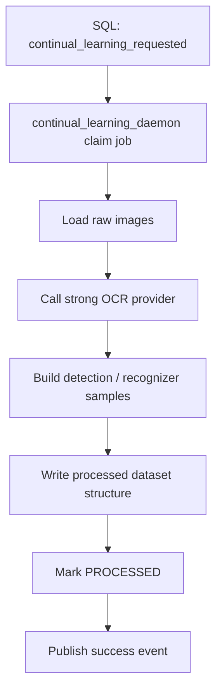

Vai trò của stage này:

- tận dụng dữ liệu raw hoặc failed sample
- dùng model mạnh hơn để enrich dataset
- biến dữ liệu đầu vào chưa chuẩn thành training-ready structure

### 6.5. Stage 4: Monitoring + MLflow + artifact flow

Current source:

- `mlflow_tracking_daemon` claim tracking jobs từ SQL
- workflow tracking nằm trong `modules/tracking`
- MLflow được dùng để log metric/artifact/metadata

Target business intent:

1. đọc training output
2. convert metric/log cần thiết sang MLflow
3. ghi artifact / model metadata
4. lưu run lineage
5. phát event thành công cho stage tiếp theo

Sơ đồ:

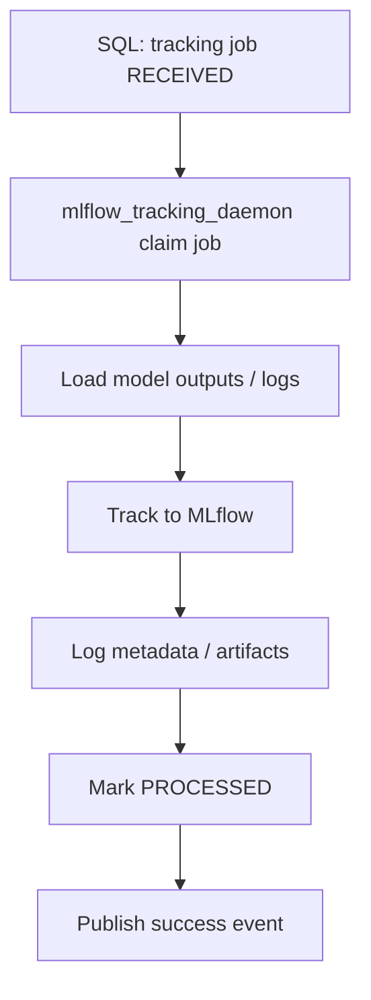

Vai trò của stage này:

- biến output training thành tracked experiment chuẩn hơn
- tạo lineage cho artifact/model
- phục vụ download/export/downstream audit

### 6.6. Stage 5: Model download flow

Current source:

- `mlflow_download_daemon` claim download jobs
- workflow download nằm trong `modules/tracking`

Target business intent:

1. nhận request download model/artifact
2. resolve artifact URL hoặc registry metadata
3. download artifact về local path cần dùng
4. cập nhật SQL state
5. phát success event

Sơ đồ:

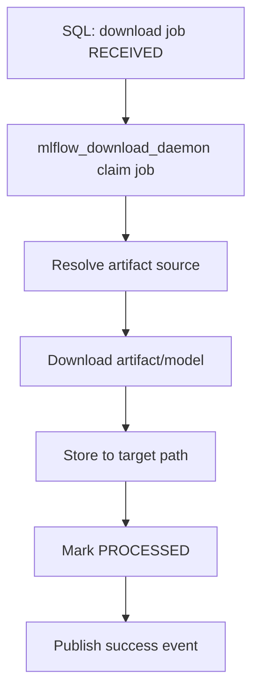

Vai trò của stage này:

- bridge giữa MLflow artifact world và local runtime world
- chuẩn bị model cho export hoặc downstream deployment preparation

### 6.7. Stage 6: Export / ONNX flow

Current source:

- `export_onnx_daemon` claim export jobs
- business nằm trong `modules/exports`

Target business intent:

1. nhận export request
2. load checkpoint/model source
3. route detection hoặc recognizer export workflow
4. tạo ONNX artifact
5. cập nhật job state
6. phát success event

Sơ đồ:

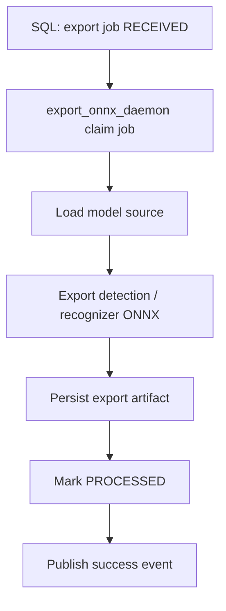

Vai trò của stage này:

- tạo artifact phục vụ downstream runtime
- tách export ra khỏi training stage
- cho phép lifecycle tiếp tục độc lập sau khi training hoàn tất

### 6.8. Stage 7: Future evaluation flow

Phần này chưa phải runtime chain rõ ràng trong source hiện tại, nhưng vẫn là hướng kiến trúc hợp lý.

Business intent:

1. lấy artifact version cũ và mới
2. chạy so sánh chất lượng
3. áp quality gate
4. nếu pass thì phát tín hiệu cho deploy/export stage kế tiếp

Sơ đồ:

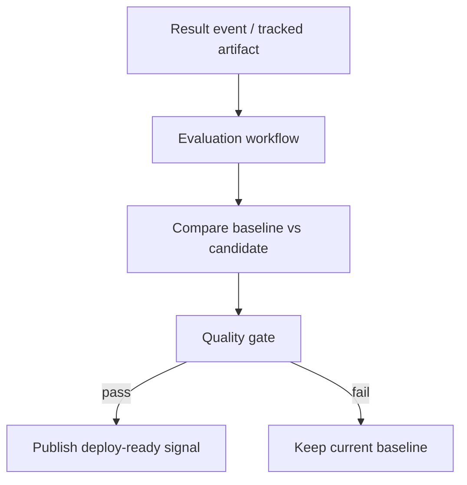

### 6.9. Stage 8: Future deploy signaling flow

Phần này cũng nên hiểu như target orchestration, không phải daemon hiện tại trong `src/`.

Business intent:

1. nhận tín hiệu artifact đã sẵn sàng
2. thông báo cho edge orchestrator hoặc deployment layer
3. downstream runtime quyết định export cuối, package, rollout

Sơ đồ:

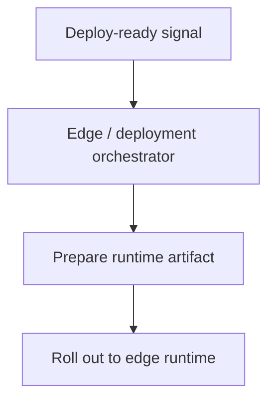

---

## 7. Service Responsibilities By Module

Phần này gom vai trò theo module/source file đang có trong source hiện tại.

### 7.1. `src/bootstrap/container.py`

Làm:

- load config
- khởi động Postgres runtime
- build success event publisher
- resolve reclaim timeout
- chạy shared shutdown logic cho worker runners

Đây là:

- `shared daemon bootstrap`
- `runtime wiring layer`

### 7.2. `src/entrypoints/kafka_ingestion/main.py`

Làm:

- nhận Kafka command
- decode message
- map message vào job ingestion use case
- insert request vào SQL
- commit offset khi ingest thành công

Đây là:

- `ingestion layer for workflow commands`

### 7.3. `src/entrypoints/training_daemon/main.py`

Làm:

- claim training job từ SQL
- khởi tạo training handler theo bootstrap chung
- chạy polling loop cho training workflow

Đây là:

- `training execution worker`

### 7.4. `src/entrypoints/dataset_daemon/main.py`

Làm:

- claim dataset job từ SQL
- route detection/recognizer dataset processing
- phát result event khi thành công

Đây là:

- `dataset execution worker`

### 7.5. `src/entrypoints/continual_learning_daemon/main.py`

Làm:

- claim continual learning job từ SQL
- chạy OCR-assisted processing
- ghi output dataset theo cấu trúc downstream cần

Đây là:

- `continual learning execution worker`

### 7.6. `src/entrypoints/mlflow_tracking_daemon/main.py`

Làm:

- claim tracking job
- chạy MLflow tracking workflow
- quản lý tracking state của model output

Đây là:

- `tracking execution worker`

### 7.7. `src/entrypoints/mlflow_download_daemon/main.py`

Làm:

- claim download job
- resolve model/artifact source
- tải artifact phục vụ downstream use case

Đây là:

- `artifact download worker`

### 7.8. `src/entrypoints/export_onnx_daemon/main.py`

Làm:

- claim export job
- route export detection/recognizer
- tạo ONNX output

Đây là:

- `export lifecycle worker`

### 7.9. `src/modules/job_control`

Làm:

- lưu event/job state
- claim next pending job
- cập nhật `PROCESSING`, `PROCESSED`, `FAILED`
- publish success event dùng chung
- shutdown/fail in-flight job khi worker dừng

Đây là:

- `persistent workflow state manager`
- `shared workflow engine`

### 7.10. `src/modules/training`

Làm:

- xử lý training use case theo loại model
- route recognizer/detection workflow

Đây là:

- `training business orchestration`

### 7.11. `src/modules/dataset`

Làm:

- build dataset output cho training
- chuẩn hóa format đầu vào/đầu ra

Đây là:

- `dataset lifecycle utilities`

### 7.12. `src/modules/continual_learning`

Làm:

- load raw image
- dùng OCR mạnh để sinh sample
- convert sang dataset structure có thể train tiếp

Đây là:

- `data enrichment and continual learning utilities`

### 7.13. `src/modules/tracking`

Làm:

- MLflow tracking workflow
- download workflow
- artifact metadata flow

Đây là:

- `tracking and artifact coordination layer`

### 7.14. `src/modules/exports`

Làm:

- export detection/recognizer sang ONNX

Đây là:

- `model export orchestration`

### 7.15. `src/platform/*`

Làm:

- config loader
- logger
- Kafka client wrapper
- Postgres runtime
- MLflow/platform integration
- OCR adapter

Đây là:

- `infrastructure implementation layer`

---

## 8. SQL State And Realtime Monitoring

Một điểm quan trọng của source này là:

- mỗi Kafka flow không chỉ đi qua topic
- mà còn được ghi xuống SQL

Mục đích:

- kiểm tra realtime dễ hơn
- query được lịch sử
- phát hiện job treo/pending
- debug nhanh hơn so với chỉ đọc log
- hỗ trợ restart/reclaim sau crash

### 8.1. SQL state machine logic

Trạng thái chuẩn trong source hiện tại:

- `RECEIVED`
- `PROCESSING`
- `PROCESSED`
- `FAILED`

Áp dụng cho:

- training job
- dataset job
- continual learning job
- tracking job
- download job
- export job

Luồng state chuẩn:

1. ingestion insert `RECEIVED`
2. worker claim job và set `PROCESSING`
3. nếu xong thì set `PROCESSED`
4. nếu lỗi thì set `FAILED`
5. nếu worker bị ngắt khi đang chạy thì shutdown path cố mark `FAILED`
6. nếu crash cứng, stale `PROCESSING` có thể được reclaim

### 8.2. SQL + Kafka correlation

Mỗi event Kafka nên map với:

- `request_id`
- `event_type`
- `topic`
- `status`
- `created_at`
- `updated_at`
- `error_message`
- `server_id` hoặc worker ownership context nếu cần

Điều này giúp:

- biết event nào đã vào DB nhưng chưa xử lý
- biết worker nào đã claim job
- biết job fail ở bước nào
- biết job nào cần reclaim sau crash

### 8.3. Reclaim and stale job recovery

Source hiện tại đã có reclaim logic qua:

- `job_control.reclaim.default_processing_timeout_seconds`
- `job_control.reclaim.overrides.*`
- CLI override `--reclaim-timeout-seconds`

Rule:

- worker chỉ reclaim job `PROCESSING` nếu `updated_at` cũ hơn timeout
- timeout có thể khác nhau theo loại job

Ý nghĩa vận hành:

- tránh job treo vô hạn
- cho phép process mới nhận lại job đang dở
- giảm phụ thuộc vào việc phải xử lý tay trong SQL sau crash

### 8.4. Success event publishing

Source hiện tại đã thêm shared success event publishing:

- sau khi job `PROCESSED`
- worker publish event thành công vào result topic dùng chung

Ý nghĩa:

- giảm duplicate logic publish ở từng daemon
- tạo contract đồng nhất cho downstream consumers
- dễ thay đổi schema/event envelope ở một điểm tập trung hơn

### 8.5. Monitoring objective

Observability nên xem qua:

- latency của ingestion
- tỷ lệ claim thành công/thất bại
- backlog job theo `event_type`
- số job stale/reclaimed
- tỷ lệ `PROCESSED` / `FAILED`
- độ ổn định của worker shutdown/restart

Prometheus metrics có thể chưa đầy đủ trong source hiện tại, nhưng về mặt kiến trúc các metric hữu ích sẽ gồm:

- `kafka_messages_received_total`
- `kafka_messages_failed_total`
- `job_received_total`
- `job_processed_total`
- `job_failed_total`
- `job_reclaimed_total`
- `job_processing_duration_seconds`
- `worker_shutdown_inflight_failed_total`

---

## 9. Failure And Recovery

Phần này mô tả các failure mode theo cả runtime hiện tại và target lifecycle intent.

### 9.1. Kafka ingestion lỗi

Triệu chứng:

- message consume được nhưng ingest không vào SQL
- payload invalid
- DB transaction lỗi

Recovery:

- không commit offset nếu ingest chưa thành công
- log đủ request/topic/offset
- fix schema rồi replay lại nếu cần

### 9.2. Claim job lỗi

Triệu chứng:

- worker polling nhưng không claim được job hợp lệ
- SQL row shape không đúng
- job state conflict

Recovery:

- sửa repository/query mapping
- đảm bảo contract cột SQL đồng nhất với domain DTO
- dùng reclaim logic đúng timeout thay vì hardcode

### 9.3. Worker crash giữa chừng

Triệu chứng:

- job đang `PROCESSING`
- process chết trước khi mark `FAILED` hoặc `PROCESSED`

Recovery hiện tại:

- shutdown path cố mark in-flight job thành `FAILED`
- nếu crash cứng không kịp update SQL, stale `PROCESSING` sẽ được reclaim theo timeout config

### 9.4. Dataset shaping lỗi

Triệu chứng:

- input data thiếu
- output format không đúng cái `ml/training` cần

Recovery:

- fail-fast trước khi publish success event
- giữ error_message trong SQL
- không để downstream training nhận dataset chưa hợp lệ

### 9.5. Continual learning OCR lỗi

Triệu chứng:

- OCR provider lỗi credentials / request / quota
- raw image hỏng hoặc format sai
- output recognizer/detection sample không đúng schema

Recovery:

- mark job `FAILED`
- log path/input causing error
- sửa config credentials hoặc normalize input format rồi retry

### 9.6. Training workflow lỗi

Triệu chứng:

- training use case raise exception
- artifact/checkpoint không sinh ra

Recovery:

- log stdout/stderr tương ứng nếu có
- mark SQL `FAILED`
- không publish success event khi training chưa hoàn tất

### 9.7. MLflow tracking lỗi

Triệu chứng:

- không tạo được run
- log metric/artifact lỗi
- end run ở trạng thái fail

Recovery:

- giữ output local nếu cần
- retry hoặc rerun tracking job
- không làm hỏng state training job gốc nếu đã tách phase

### 9.8. Download artifact lỗi

Triệu chứng:

- resolve artifact source lỗi
- download bị timeout hoặc path target không hợp lệ

Recovery:

- fail job riêng ở phase download
- giữ trace artifact uri/run id để debug

### 9.9. Export ONNX lỗi

Triệu chứng:

- checkpoint không hợp lệ
- export recognizer/detection fail
- artifact xuất ra không usable

Recovery:

- mark `FAILED`
- không phát success event
- giữ input model reference để retry có kiểm soát

### 9.10. Evaluation reject trong target architecture

Triệu chứng:

- version mới không tốt hơn version cũ

Recovery:

- không publish deploy-ready signal
- giữ artifact để audit
- cập nhật kết quả vào tracking/storage layer nếu workflow này được hoàn thiện

### 9.11. Deploy/export fail downstream

Triệu chứng:

- downstream edge export fail
- deploy signal đã phát nhưng rollout không hoàn tất

Recovery:

- correlation bằng request/result event
- rollback hoặc giữ current production version ở downstream system

---

## 10. Suggested Source Layout And Reading Order

Source hiện tại nên được hiểu theo layout logic sau:

```text
services/model-lifecycle-service/
  config/
    .env
    model_lifecycle_orchestrator_config.yaml
  docs/
  src/
    bootstrap/
      __init__.py
      container.py
    entrypoints/
      kafka_ingestion/
      training_daemon/
      dataset_daemon/
      continual_learning_daemon/
      mlflow_tracking_daemon/
      mlflow_download_daemon/
      export_onnx_daemon/
    modules/
      job_control/
      training/
      dataset/
      continual_learning/
      tracking/
      exports/
    platform/
      config/
      logger/
      messaging/kafka/
      persistence/postgres/
      tracking/mlflow/
      vision/
    shared_kernel/
  model-lifecycle-orchestrator-flow.md
```

### 10.1. Cách đọc source nhanh

Nếu muốn hiểu source này nhanh nhất, nên đọc theo thứ tự:

1. `config/model_lifecycle_orchestrator_config.yaml`
2. `config/.env`
3. `src/bootstrap/container.py`
4. `src/entrypoints/kafka_ingestion/main.py`
5. một worker daemon bất kỳ, ví dụ `src/entrypoints/continual_learning_daemon/main.py`
6. `src/modules/job_control/application/use_case/process_next_job.py`
7. `src/modules/job_control/adapters/outbound/persistence/postgres/*`
8. module business cần quan tâm:
   - `src/modules/training/*`
   - `src/modules/dataset/*`
   - `src/modules/continual_learning/*`
   - `src/modules/tracking/*`
   - `src/modules/exports/*`
9. `src/platform/*` cho infra detail

### 10.2. Source này làm gì trong toàn hệ thống

Source này đứng giữa:

- upstream request producers
- SQL state persistence
- `ml/training`
- `MLflow`
- OCR provider
- artifact/download/export workflows
- downstream orchestration khác

Nó là nơi biến:

- raw request event
- raw image/input data
- training/export intent
- artifact tracking intent

thành:

- persisted job state
- standardized dataset structure
- tracked model run
- downloaded/exported artifact
- success event cho downstream systems

### 10.3. Kết luận thực thi

`services/model-lifecycle-service` là một orchestrator nhiều phase cho vòng đời AI.

Nó chịu trách nhiệm:

- điều phối `training`
- điều phối `dataset shaping`
- điều phối `continual learning`
- điều phối `tracking`
- điều phối `artifact download`
- điều phối `ONNX export`
- chuẩn bị nền cho evaluation/deploy signaling ở mức hệ thống lớn hơn

Nó không phải nơi inference trực tiếp, cũng không phải toàn bộ deployment runtime cuối.

Nó là nơi nối các bước lifecycle lại thành pipeline có:

- Kafka để nhận/publish event
- SQL để tra cứu và điều phối worker
- bootstrap chung để giảm duplicate runtime logic
- reclaim/shutdown handling để vận hành ổn định hơn

---

## 11. What Changed Compared To Older Interpretations

Phần này để tránh lẫn giữa tài liệu cũ và source hiện tại.

### 11.1. Điều đã thay đổi rõ trong runtime hiện tại

- không còn hiểu worker chính là Kafka consumer trực tiếp cho request flow
- đã có `kafka_ingestion` làm process ingest riêng
- các daemon claim job từ SQL
- đã có shared bootstrap trong `src/bootstrap`
- success event publishing đã được gom lại dùng chung
- reclaim timeout đã đi theo config thay vì hardcode một kiểu cho mọi job

### 11.2. Điều vẫn còn đúng ở mức kiến trúc

- source này vẫn là orchestrator của AI lifecycle
- event-driven workflow vẫn là trục chính
- SQL state vẫn là trung tâm cho realtime control
- dataset/training/tracking/export vẫn là các capability chính
- evaluation/deploy vẫn là hướng mở rộng hợp lý của orchestration chain

### 11.3. Cách đọc đúng để không hiểu sai

Không nên đọc tài liệu theo kiểu:

- "chưa có daemon riêng thì capability đó không tồn tại"
- "chưa chạy end-to-end đủ mọi phase thì thiết kế cũ là sai hoàn toàn"

Nên đọc theo kiểu:

- runtime hiện tại đã rõ ở lớp ingestion + SQL + worker daemons
- phần capability lớn hơn của lifecycle vẫn là định hướng hệ thống
- source đang dần hội tụ về kiến trúc rõ ràng hơn, chứ không phải bỏ đi bài toán lifecycle ban đầu
