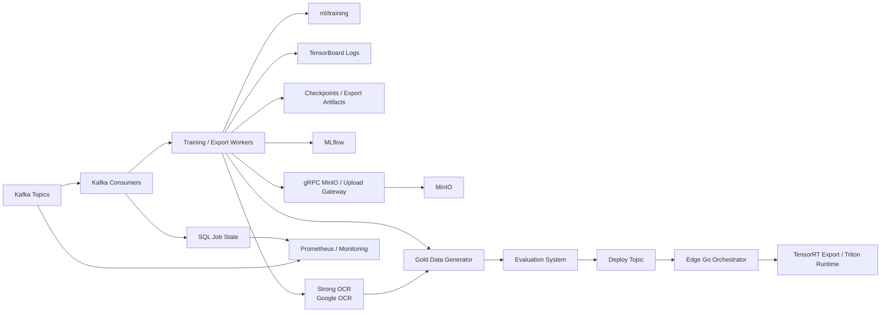
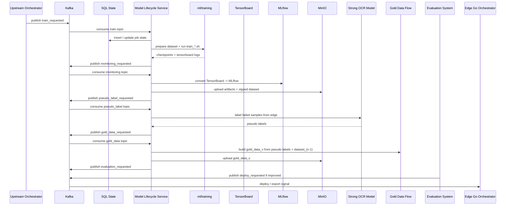
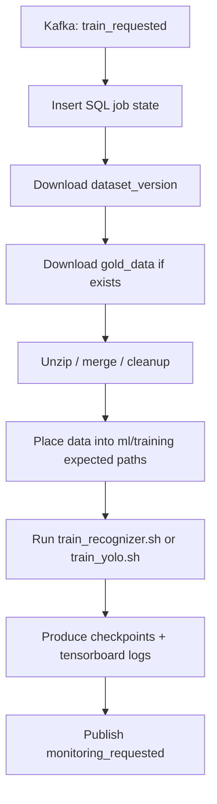
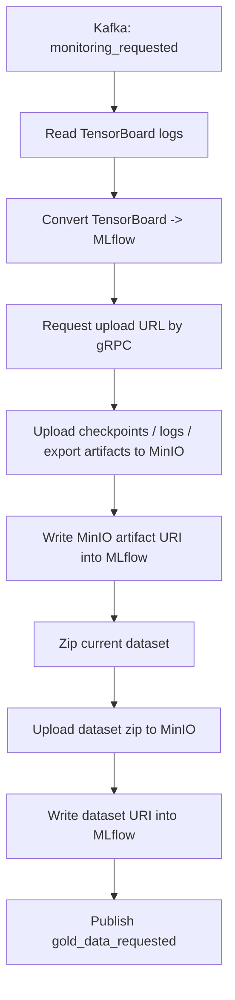
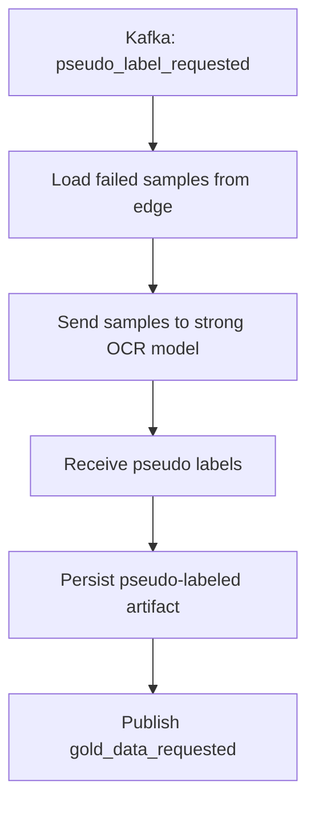
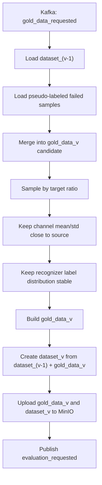
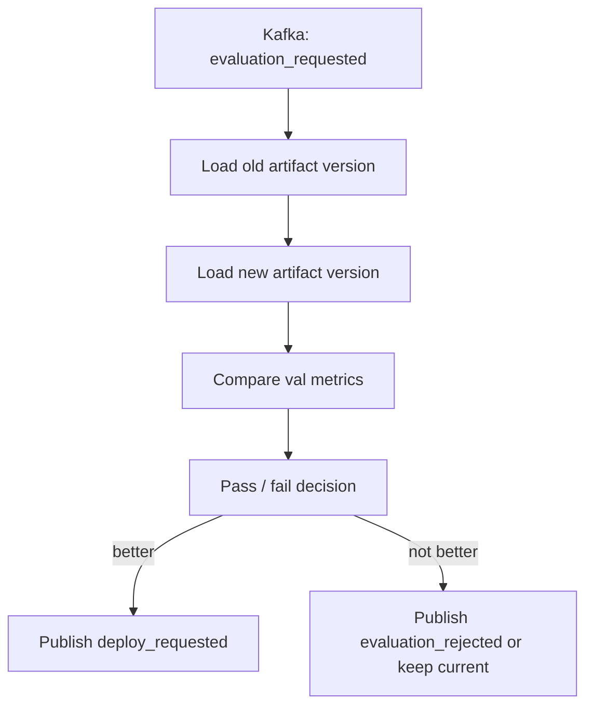
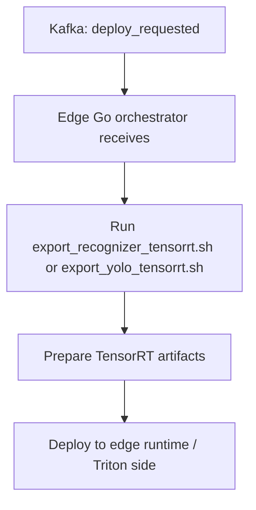

# Model Lifecycle Orchestrator Flow

## 1. Overview

Source `services/model-lifecycle-service` là orchestrator cho toàn bộ vòng đời AI trong hệ thống.

Vai trò chính của source này không phải train model trực tiếp, cũng không phải inference runtime trực tiếp, mà là điều phối các bước:

- nhận command qua `Kafka`
- quản lý trạng thái job bằng `SQL`
- chuẩn bị dataset đúng format cho `ml/training`
- gọi shell script train hoặc export
- convert tracking từ `TensorBoard` sang `MLflow`
- upload artifact và dataset lên `MinIO`
- dùng một model OCR mạnh hơn để gán nhãn lại các mẫu fail từ edge
- tạo `gold_data`
- phát tín hiệu cho hệ thống đánh giá
- phát tín hiệu deploy cho edge runtime

Nói ngắn gọn, source này là:

- `AI lifecycle orchestrator`
- `training artifact coordinator`
- `dataset lifecycle coordinator`
- `event-driven control plane`

Các luồng lớn của source này:

1. `Training flow`
2. `Monitoring / MLflow / artifact upload flow`
3. `Pseudo-label flow with strong OCR model`
4. `Gold-data extraction flow`
5. `Evaluation flow`
6. `Deploy/export flow`

Các thành phần hạ tầng chính:

- `Kafka`
- `SQL`
- `gRPC clients`
- `MinIO`
- `MLflow`
- `ml/training`
- `edge go orchestrator`
- `Prometheus`

Sơ đồ tổng thể:



---

## 2. Technology Map

Phần này mô tả công nghệ dùng trong source và nhìn vào đó có thể biết source này làm gì.

### 2.1. Python service layer

Công nghệ chính:

- `Python`
- `argparse`
- structured modules trong `src/`

Vai trò:

- tổ chức luồng orchestration
- chạy worker
- gọi service khác
- ghép logic lifecycle cho training, artifact, dataset, deploy

Nếu nhìn vào phần này, có thể hiểu đây là:

- `application orchestration layer`

### 2.2. Kafka layer

Công nghệ chính:

- `aiokafka`
- `confluent-kafka`
- custom consumer/producer wrapper
- topic routing handler

Vai trò:

- nhận command từ upstream orchestrator
- phát event giữa các phase lifecycle
- tách các bước train, monitoring, gold-data, evaluation, deploy

Nếu nhìn vào Kafka layer, có thể hiểu đây là:

- `event bus`
- `async workflow trigger layer`

### 2.3. SQL state layer

Công nghệ chính:

- custom `sql.py`
- custom queries trong `src/infra/queries`
- job repository cho training/export

Vai trò:

- lưu trạng thái realtime của job
- lưu request đã nhận
- lưu job pending, processing, success, failed
- giúp kiểm tra realtime dễ hơn thay vì chỉ đọc Kafka stream

Nếu nhìn vào SQL layer, có thể hiểu đây là:

- `workflow state persistence layer`

### 2.4. gRPC layer

Công nghệ chính:

- `grpcio`
- `grpcio-tools`
- outbound client cho upload/download
- inbound gRPC server cho file orchestrator

Vai trò:

- xin upload URL từ MinIO/object-storage service
- upload artifact/dataset qua flow có kiểm soát
- có thể nhận request upload/download từ bên ngoài

Nếu nhìn vào gRPC layer, có thể hiểu đây là:

- `artifact transfer control layer`

### 2.5. MLflow layer

Công nghệ chính:

- `mlflow`
- artifact logging
- metric logging

Vai trò:

- convert log từ TensorBoard sang MLflow
- ghi artifact training
- ghi artifact dataset, link MinIO, model lineage
- tạo trung tâm tracking cho mỗi training run

Nếu nhìn vào MLflow layer, có thể hiểu đây là:

- `experiment tracking layer`

### 2.6. MinIO integration

Công nghệ chính:

- gRPC upload URL gateway
- upload file/folder helper

Vai trò:

- upload checkpoint, ONNX, logs, zipped dataset
- lưu artifact bền vững ngoài máy local
- tạo artifact URI dùng tiếp trong MLflow và deploy

Nếu nhìn vào MinIO integration, có thể hiểu đây là:

- `artifact storage layer`

### 2.7. Dataset shaping layer

Công nghệ chính:

- `create_data_manifest.py`
- `create_god_dataset_detection.py`
- `create_god_dataset_recognizer.py`
- zip helper
- strong OCR integration cho pseudo-label

Vai trò:

- tổng hợp dataset version + gold data
- dùng OCR mạnh hơn để gán nhãn lại mẫu fail từ edge
- tạo manifest
- tạo gold dataset theo tỷ lệ sample mong muốn
- cố giữ phân phối dữ liệu không lệch quá mạnh

Nếu nhìn vào dataset shaping layer, có thể hiểu đây là:

- `dataset curation layer`

### 2.8. Worker/process layer

Entry points đã thấy trong source:

- `main_kafka_consumer.py`
- `main_training_worker.py`
- `main_export_kafka_consumer.py`
- `main_export_worker.py`
- `main.py`

Vai trò:

- phân vai giữa consumer và worker
- tách ingestion khỏi execution
- giúp lifecycle chạy bất đồng bộ hơn

Nếu nhìn vào nhóm này, có thể hiểu đây là:

- `process topology layer`

### 2.9. Monitoring layer

Công nghệ chính:

- `Prometheus`
- custom metrics từ Kafka/SQL/job layer

Vai trò:

- đo latency Kafka
- đo tỷ lệ thành công/thất bại
- đo số job pending
- hỗ trợ quan sát lifecycle AI realtime

Nếu nhìn vào monitoring layer, có thể hiểu đây là:

- `operational observability layer`

---

## 3. End-to-End Lifecycle Flow

Đây là luồng tổng từ khi có yêu cầu train cho đến khi có tín hiệu deploy xuống edge.



### 3.1. Event-driven AI lifecycle

Source này không chạy theo một command đồng bộ duy nhất.

Thay vào đó, mỗi phase của vòng đời AI được nối bằng:

- `Kafka topic`
- `SQL state`
- `worker riêng`

Điều này giúp:

- dễ scale
- dễ retry
- dễ quan sát
- dễ tách lỗi theo từng phase

### 3.2. Source tương quan với các source khác

Source này phụ thuộc mạnh vào:

- `ml/training`
- `object-storage-service`
- `MLflow`
- `evaluation system`
- `edge go orchestrator`

Nó là lớp nằm giữa:

- `training source`
- `artifact storage`
- `tracking`
- `deployment`

---

## 4. Kafka-Driven Workflow Stages

Phần này mô tả đúng các service/flow chính mà bạn yêu cầu.

### 4.1. Stage 1: Training flow

Khi nhận topic training:

1. source này nhận command qua Kafka
2. ghi trạng thái job vào SQL
3. download `dataset_version`
4. download `data_gold` nếu có
5. giải nén, tổng hợp, xóa zip tạm nếu cần
6. đưa dữ liệu vào đúng vị trí mà `ml/training` cần
7. chọn script train tương ứng:
   - `train_recognizer.sh`
   - `train_yolo.sh`
8. chạy training
9. nhận output:
   - checkpoint
   - tensorboard logs
   - dataset statistics
10. gửi topic tiếp theo cho phase monitoring

Sơ đồ:



Vai trò của stage này:

- bridge giữa dataset storage và `ml/training`
- đảm bảo training source nhận đúng data layout
- chuẩn hóa artifact đầu ra cho các phase sau

### 4.2. Stage 2: Monitoring + MLflow + artifact upload flow

Khi nhận topic monitoring:

1. source này đọc TensorBoard output
2. convert TensorBoard metrics sang MLflow
3. xin upload URL qua gRPC client
4. upload artifact training lên MinIO
5. ghi đường dẫn MinIO vào MLflow
6. zip dataset hiện tại
7. upload dataset zip lên MinIO
8. ghi đường dẫn dataset vào MLflow
9. publish topic `gold_data_requested`

Sơ đồ:



Vai trò của stage này:

- biến training output thành tracked experiment chuẩn hơn
- tách artifact khỏi local machine
- chuẩn bị lineage cho evaluation và deploy

### 4.3. Stage 3: Pseudo-label flow with strong OCR model

Khi nhận topic `pseudo_label`:

1. source này lấy các sample `failed` từ edge
2. gửi các sample này tới một model OCR mạnh hơn
3. model mạnh ở đây có thể là:
   - `Google OCR`
   - hoặc OCR cloud mạnh tương đương
4. nhận pseudo-label
5. lưu pseudo-label như artifact trung gian
6. publish topic `gold_data_requested`

Sơ đồ:



Vai trò của stage này:

- tận dụng các mẫu fail ở edge
- dùng model mạnh hơn để gán nhãn lại
- biến dữ liệu fail thành đầu vào chất lượng cao hơn cho vòng dataset tiếp theo

### 4.4. Stage 4: Gold-data extraction flow

Khi nhận topic `gold_data`:

1. source này lấy `dataset_(v-1)`
2. lấy pseudo-labeled data mới từ stage trước
3. hợp nhất chúng để tạo `gold_data_v`
4. sample theo tỷ lệ mong muốn
5. cố giữ phân phối dữ liệu không lệch quá mạnh
6. với ảnh:
   - cố giữ `mean/std` theo từng channel gần dữ liệu gốc
7. với recognizer:
   - cố giữ phân phối số lượng label / text pattern
8. tạo `gold_data_v`
9. từ `gold_data_v` tạo dataset version mới bằng cách cộng với `dataset_(v-1)`
10. upload `gold_data_v` và dataset version mới lên MinIO qua gRPC upload flow
11. publish topic cho hệ thống đánh giá

Sơ đồ:



Vai trò của stage này:

- sinh tập dữ liệu đánh giá/rà soát chất lượng tinh gọn
- tránh lệch distribution
- đặc biệt hữu ích cho recognizer vì label distribution rất nhạy
- tạo vòng lặp cải thiện dữ liệu từ failed samples ngoài edge

### 4.5. Stage 5: Evaluation flow

Khi nhận topic đánh giá:

1. hệ thống đánh giá lấy 2 version artifact
2. chạy so sánh:
   - metric validation
   - quality gate
   - performance gate nếu có
3. nếu version mới tốt hơn thì publish topic deploy

Sơ đồ:



Vai trò của stage này:

- chặn model xấu trước khi deploy
- tạo gate giữa training và edge production

### 4.6. Stage 6: Deploy / export flow

Khi có topic deploy:

1. thông tin deploy được publish
2. edge `Go orchestrator` nhận thấy topic này
3. edge chạy script export TensorRT tương ứng
4. thông tin export xuất phát từ source lifecycle này
5. sau đó edge hoàn tất flow deploy/inference runtime phía nó

Điểm quan trọng:

- flow export TensorRT ở đây có quan hệ trực tiếp với `services/model-lifecycle-service`
- source này là nơi phát command logic cho bước deploy tiếp theo
- edge là nơi thực thi cuối
- edge sẽ chạy script export thực tế nằm trong:
  - `/home/minhtk/code/overwatch-edge-ai/worktree/backend_nexus/ml/training/scripts/export_recognizer_tensorrt.sh`
  - `/home/minhtk/code/overwatch-edge-ai/worktree/backend_nexus/ml/training/scripts/export_yolo_tensorrt.sh`

Sơ đồ:



---

## 5. Service Responsibilities By Module

Phần này gom vai trò theo module/source file đang có.

### 5.1. `main_kafka_consumer.py`

Làm:

- nhận Kafka command
- route command theo topic/job key
- chuyển request vào đúng handler

Đây là:

- `ingestion layer for workflow commands`

### 5.2. `main_training_worker.py`

Làm:

- claim training job từ SQL/job repository
- chạy `TrainingWorker`
- phát event kết quả

Đây là:

- `training execution worker`

### 5.3. `main_export_kafka_consumer.py` và `main_export_worker.py`

Làm:

- nhận export command
- đưa vào export job repository
- chạy export worker

Đây là:

- `export lifecycle worker`

### 5.4. `src/applications/use_cases/training_worker.py`

Làm:

- chọn script training theo model name
- gọi `train_recognizer.sh` hoặc `train_yolo.sh`
- gắn kết quả vào event

Đây là:

- `bridge from Kafka job to ml/training execution`

### 5.5. `src/applications/use_cases/export_worker.py`

Làm:

- chọn script export theo model name
- gọi export tương ứng

Đây là:

- `bridge from export topic to artifact export`

### 5.6. `src/adapter/outbound/get_link_upload_url.py`

Làm:

- gRPC client xin upload URL
- upload orchestrator / download orchestrator

Đây là:

- `artifact transfer gateway`

### 5.7. `src/infra/sql.py` và job repositories

Làm:

- lưu event/job state
- claim next pending job
- cập nhật processed / failed

Đây là:

- `persistent workflow state manager`

### 5.8. `create_god_dataset_*` và `create_data_manifest.py`

Làm:

- tạo subset/gold dataset
- tạo manifest
- giữ thống kê dữ liệu

Đây là:

- `dataset lifecycle utilities`

---

## 6. SQL State And Realtime Monitoring

Một điểm quan trọng của source này là:

- mỗi Kafka flow không chỉ đi qua topic
- mà còn được ghi xuống SQL

Mục đích:

- kiểm tra realtime dễ hơn
- query được lịch sử
- phát hiện job treo/pending
- debug nhanh hơn so với chỉ đọc log

### 6.1. SQL state machine logic

Trạng thái điển hình:

- `pending`
- `processing`
- `processed`
- `failed`

Có thể áp dụng cho:

- training job
- export job
- deploy-related command

### 6.2. SQL + Kafka correlation

Mỗi event Kafka nên map với:

- `request_id`
- `job_key`
- `topic`
- `status`
- `created_at`
- `updated_at`
- `error_message`

Điều này giúp:

- biết event nào đã vào DB nhưng chưa xử lý
- biết worker nào đã claim job
- biết job fail ở bước nào

### 6.3. Prometheus metrics

Source này nên expose metrics kiểu:

- `kafka_consume_latency_seconds`
- `kafka_produce_latency_seconds`
- `kafka_messages_received_total`
- `kafka_messages_failed_total`
- `training_jobs_pending`
- `training_jobs_processing`
- `training_jobs_failed_total`
- `export_jobs_failed_total`
- `upload_failures_total`
- `gold_data_generation_seconds`
- `pseudo_label_generation_seconds`
- `evaluation_trigger_total`
- `deploy_trigger_total`

### 6.4. Monitoring objective

Prometheus ở đây dùng để xem:

- latency của Kafka
- tỷ lệ thành công/thất bại
- backlog job
- bottleneck của từng stage

Tức là source này không chỉ orchestration logic, mà còn là nơi phải vận hành được trong production.

---

## 7. Failure And Recovery

### 7.1. Dataset download lỗi

Triệu chứng:

- không download được `dataset_version`
- không lấy được `gold_data`

Recovery:

- retry download
- giữ job ở `failed` hoặc `pending retry`
- publish event lỗi có request id

### 7.2. Merge dataset lỗi

Triệu chứng:

- unzip lỗi
- path không đúng format mà `ml/training` cần

Recovery:

- cleanup temp dir
- fail-fast trước khi chạy train
- lưu lỗi vào SQL

### 7.3. Training script fail

Triệu chứng:

- `train_*.sh` return non-zero
- checkpoint không sinh ra

Recovery:

- ghi stderr/stdout vào log
- đánh dấu failed trong SQL
- không publish bước monitoring nếu train chưa xong

### 7.4. TensorBoard to MLflow fail

Triệu chứng:

- metric convert lỗi
- artifact log lỗi

Recovery:

- retry theo phase
- có thể fallback local artifact path
- không mất checkpoint gốc

### 7.5. MinIO upload fail

Triệu chứng:

- gRPC lấy URL lỗi
- upload artifact lỗi

Recovery:

- retry backoff
- giữ artifact local
- đánh dấu upload pending

### 7.6. Pseudo-label quality kém

Triệu chứng:

- OCR mạnh gán nhãn sai nhiều
- failed samples quay ngược lại làm nhiễu dataset

Recovery:

- filter theo confidence
- chỉ giữ pseudo-label đủ mạnh
- thêm bước manual review nếu cần

### 7.7. Gold-data distribution lệch

Triệu chứng:

- subset bị lệch mean/std
- recognizer label distribution méo

Recovery:

- rerun sampling
- validate thống kê trước khi publish evaluation_requested

### 7.8. Evaluation reject

Triệu chứng:

- version mới không tốt hơn version cũ

Recovery:

- không publish deploy
- giữ artifact để audit
- cập nhật result vào MLflow/SQL

### 7.9. Deploy/export fail downstream

Triệu chứng:

- edge export TensorRT fail
- deploy topic đã phát nhưng edge không hoàn tất

Recovery:

- publish deploy_failed
- giữ current production version
- cần correlation giữa lifecycle service và edge orchestrator

---

## 8. Suggested Source Layout And Reading Order

Source hiện tại có thể hiểu theo layout logic sau:

```text
services/model-lifecycle-service/
  config/
    model_lifecycle_orchestrator_config.yaml
  main.py
  main_kafka_consumer.py
  main_training_worker.py
  main_export_kafka_consumer.py
  main_export_worker.py
  src/
    adapter/
      inbound/
      outbound/
    applications/
      dtos/
      ports/
      services/
      use_cases/
    domain/
    infra/
      config/
      queries/
      kafka_*.py
      sql.py
    proto/
    utils/
  tests/
  model-lifecycle-orchestrator-flow.md
```

### 8.1. Cách đọc source nhanh

Nếu muốn hiểu source này nhanh nhất, nên đọc theo thứ tự:

1. `config/model_lifecycle_orchestrator_config.yaml`
2. `main_kafka_consumer.py`
3. `main_training_worker.py`
4. `main_export_kafka_consumer.py`
5. `main_export_worker.py`
6. `src/applications/use_cases/training_worker.py`
7. `src/applications/use_cases/export_worker.py`
8. `src/adapter/outbound/get_link_upload_url.py`
9. `src/infra/sql.py`
10. `src/infra/queries/*`
11. `src/applications/use_cases/create_god_dataset_*`

### 8.2. Source này làm gì trong toàn hệ thống

Source này đứng giữa:

- `dataset storage`
- `ml/training`
- `TensorBoard`
- `MLflow`
- `MinIO`
- `evaluation system`
- `edge deploy`

Nó là nơi biến:

- raw dataset version
- pseudo-labeled failed samples
- gold data
- training request
- export request

thành:

- trained checkpoint
- tracked MLflow run
- uploaded artifacts
- gold_data_v
- gold dataset
- evaluation trigger
- deploy trigger

### 8.3. Kết luận thực thi

`services/model-lifecycle-service` là một orchestrator nhiều phase cho vòng đời AI.

Nó chịu trách nhiệm:

- điều phối `training`
- điều phối `artifact tracking`
- điều phối `dataset curation`
- điều phối `evaluation trigger`
- điều phối `deploy trigger`

Nó không phải nơi train model lõi, không phải nơi inference trực tiếp, mà là nơi nối toàn bộ các bước vòng đời AI lại thành một pipeline có thể vận hành, có SQL để tra cứu, có Kafka để mở rộng, và có Prometheus để quan sát realtime.
