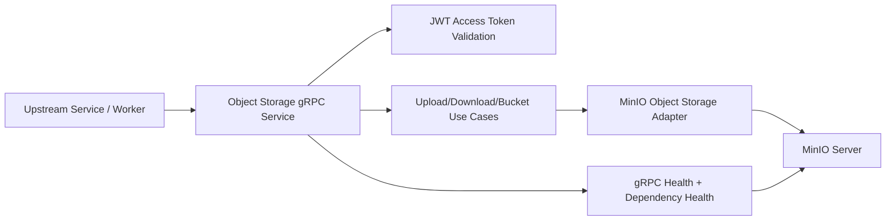
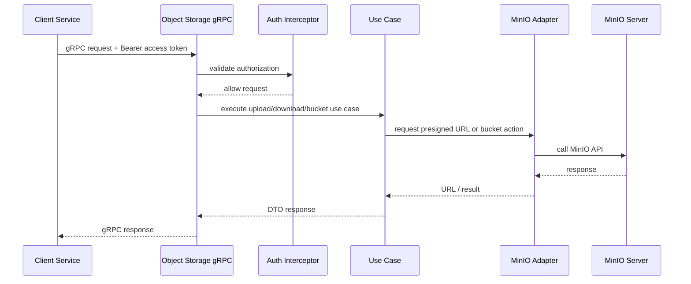

# Object Storage Service Flow

## 1. Overview

Source `services/object-storage-service` là service object storage nội bộ của hệ thống, dùng `MinIO` làm backend lưu trữ và expose `gRPC API` cho các service khác.

Vai trò chính của source này:

- cấp `upload URL` cho client/service khác
- cấp `download URL` cho client/service khác
- quản lý `bucket`
- xác thực truy cập bằng `refresh token` + `access token`
- kiểm tra health của MinIO dependency

Source này không upload file trực tiếp thay cho client.

Nó làm 2 việc chính:

- `control-plane cho object storage`
- `security gate cho presigned URL`

Mục tiêu của source:

- chuẩn hóa truy cập MinIO qua gRPC
- tách logic auth/token ra khỏi các service consumer
- cho phép các service khác xin URL upload/download an toàn
- hỗ trợ observability và health status của MinIO

Sơ đồ tổng thể:



Source này đóng vai trò trung gian giữa:

- `model-lifecycle-service`
- các service upload/download artifact
- `MinIO`

---

## 2. Technology Map

Phần này mô tả công nghệ dùng trong source và nhìn vào đó có thể biết source này làm gì.

### 2.1. Go service layer

Công nghệ chính:

- `Go`
- package layout theo `cmd/`, `internal/`

Vai trò:

- tổ chức service
- khởi động gRPC server
- wiring config, logger, MinIO client, use case, handler

Nếu nhìn vào phần này, có thể hiểu đây là:

- `service composition layer`

### 2.2. gRPC layer

Công nghệ chính:

- `google.golang.org/grpc`
- generated proto từ `database_service.pb.go`
- unary interceptor
- gRPC reflection
- gRPC health service

Vai trò:

- expose API cho object storage
- kiểm tra auth token
- cung cấp health check
- đóng vai public interface của service

Nếu nhìn vào gRPC layer, có thể hiểu đây là:

- `service interface layer`

### 2.3. MinIO integration

Công nghệ chính:

- `github.com/minio/minio-go`
- `minio_client.go`
- `minio_object_storage.go`

Vai trò:

- kết nối tới MinIO
- gọi API presign upload/download
- quản lý bucket operations

Nếu nhìn vào phần này, có thể hiểu đây là:

- `storage adapter layer`

### 2.4. Auth và token layer

Công nghệ chính:

- custom token utils trong `internal/utils/token.go`
- `JWT secret`
- `refresh token`

Vai trò:

- cấp `access token` ngắn hạn từ `refresh token`
- validate token ở interceptor
- chặn mọi request gRPC không hợp lệ

Nếu nhìn vào phần này, có thể hiểu đây là:

- `security gate layer`

### 2.5. Config layer

Công nghệ chính:

- `config/minio_config.yaml`
- `.env`
- custom `config_loader.go`

Vai trò:

- load MinIO endpoint
- load credential
- load TTL cho token và presigned URL
- load TLS config

Nếu nhìn vào phần này, có thể hiểu đây là:

- `runtime configuration layer`

### 2.6. Health monitoring layer

Công nghệ chính:

- `grpc_health_manager.go`
- `grpc_healthcheck.go`
- gRPC health API

Vai trò:

- kiểm tra connection tới MinIO
- kiểm tra MinIO client còn hoạt động
- đồng bộ status dependency vào gRPC health state

Nếu nhìn vào phần này, có thể hiểu đây là:

- `dependency health layer`

### 2.7. Testing layer

Công nghệ chính:

- Go test
- unit tests cho token, config, client, object storage, grpc handler
- e2e shell script

Vai trò:

- xác minh config validation
- xác minh auth/token logic
- xác minh handler response
- xác minh MinIO integration cơ bản

Nếu nhìn vào phần này, có thể hiểu đây là:

- `quality assurance layer`

---

## 3. End-to-End Storage Flow

Đây là luồng tổng khi một service khác muốn upload hoặc download artifact qua MinIO.



### 3.1. Access token flow

Client không gọi upload/download URL trực tiếp nếu chưa có access token.

Luồng chuẩn:

1. gọi `RefreshAccessToken`
2. gửi `refresh token` tĩnh
3. service trả về `access token`
4. client dùng `access token` đó cho các API gRPC còn lại

### 3.2. Upload URL flow

Client gửi:

- `bucket_name`
- `object_name`
- `request_id`

Service trả về:

- `presigned upload URL`

Sau đó client tự upload file lên MinIO bằng URL này.

### 3.3. Download URL flow

Client gửi:

- `bucket_name`
- `object_name`
- `request_id`

Service trả về:

- `presigned download URL`

Sau đó client tự download file qua URL đó.

### 3.4. Bucket management flow

Service còn hỗ trợ:

- `BucketExists`
- `CreateBucket`
- `RemoveBucket`

Tức là source này không chỉ phát URL mà còn đóng vai lớp quản trị bucket cơ bản.

---

## 4. gRPC API Flows

Phần này mô tả từng nhóm API chính của service.

### 4.1. RefreshAccessToken

Đây là API duy nhất được miễn check access token ở interceptor.

Input:

- `refresh_token`

Flow:

1. validate refresh token với token tĩnh trong config
2. nếu hợp lệ thì ký một JWT access token
3. trả access token với TTL ngắn

Vai trò:

- cấp quyền truy cập tạm thời cho client

### 4.2. GenerateUploadUrl

Input:

- `bucket_name`
- `object_name`
- `request_id`

Flow:

1. interceptor validate access token
2. handler validate input
3. gọi `ExportUploadURLUseCase`
4. use case gọi MinIO adapter để tạo presigned upload URL
5. trả URL về client

Vai trò:

- cho client một URL upload có TTL hữu hạn

### 4.3. GenerateDownloadUrl

Input:

- `bucket_name`
- `object_name`
- `request_id`

Flow:

1. interceptor validate access token
2. handler validate input
3. gọi `ExportDownloadURLUseCase`
4. use case gọi MinIO adapter để tạo presigned download URL
5. trả URL về client

Vai trò:

- cho client một URL download có TTL hữu hạn

### 4.4. BucketExists

Flow:

1. validate access token
2. validate bucket name
3. gọi MinIO object storage adapter
4. trả trạng thái bucket tồn tại hay không

Vai trò:

- kiểm tra bucket readiness trước upload/download

### 4.5. CreateBucket

Flow:

1. validate access token
2. validate bucket name
3. gọi adapter tạo bucket
4. trả kết quả thành công/thất bại

Vai trò:

- tạo bucket khi cần bootstrap hoặc khi pipeline cần bucket mới

### 4.6. RemoveBucket

Flow:

1. validate access token
2. validate bucket name
3. gọi adapter xóa bucket
4. trả kết quả

Vai trò:

- hỗ trợ cleanup hoặc bucket lifecycle operation

### 4.7. Health service

Service còn đăng ký:

- `grpc health`
- `reflection`

Vai trò:

- cho client kiểm tra service up/down
- giúp debug proto/service contract dễ hơn

---

## 5. Service Responsibilities By Layer

### 5.1. `cmd/minio_service/main.go`

Làm:

- load config
- create MinIO client
- create object storage adapter
- create upload/download use case
- create gRPC server
- attach auth interceptor
- attach health server
- run service

Đây là:

- `service bootstrap layer`

### 5.2. `internal/adapter/inbound/minio/*`

Làm:

- nhận request gRPC
- validate request
- map request sang DTO/use case
- trả response gRPC

Đây là:

- `gRPC handler layer`

### 5.3. `internal/application/use_cases/minio/*`

Làm:

- business flow cho generate upload/download URL
- tách handler khỏi hạ tầng MinIO trực tiếp

Đây là:

- `application use case layer`

### 5.4. `internal/infra/minio_client.go`

Làm:

- tạo MinIO client từ config
- kết nối đúng endpoint/credential/TLS mode

Đây là:

- `MinIO connection factory`

### 5.5. `internal/infra/minio_object_storage.go`

Làm:

- thao tác object storage cụ thể
- presign URL
- bucket operations

Đây là:

- `storage implementation layer`

### 5.6. `internal/utils/token.go`

Làm:

- sinh access token
- parse và validate access token
- kiểm tra refresh token

Đây là:

- `token utility layer`

### 5.7. `internal/adapter/inbound/grpc_health_manager.go`

Làm:

- quản lý dependency health
- map trạng thái dependency sang grpc health status

Đây là:

- `dependency status coordinator`

---

## 6. Auth, Token, And URL Security Flow

Source này có mô hình bảo mật 2 lớp:

1. `refresh token` tĩnh
2. `access token` ngắn hạn

### 6.1. Refresh token

Refresh token:

- được cấu hình sẵn
- dùng như khóa bootstrap để xin access token
- không nên dùng trực tiếp cho mọi API

### 6.2. Access token

Access token:

- được ký bằng `jwt_secret`
- có TTL ngắn
- được gửi qua header:
  - `authorization: Bearer <token>`

Interceptor sẽ:

- bỏ qua method `RefreshAccessToken`
- bỏ qua gRPC health
- bắt buộc token hợp lệ với các method còn lại

### 6.3. Presigned URL TTL

Service còn kiểm soát TTL riêng cho:

- upload URL
- download URL

Điều này cho phép:

- giảm rủi ro rò URL
- giới hạn thời gian sử dụng

### 6.4. Security boundary

Boundary bảo mật của source này là:

- client chỉ biết `gRPC endpoint`
- client không cần biết access/secret key MinIO
- service là nơi giữ credential và phát URL tạm thời

Đây là lý do source này quan trọng trong toàn hệ thống:

- các service khác không phải cầm trực tiếp MinIO credential

---

## 7. Failure And Recovery

### 7.1. Config sai

Triệu chứng:

- endpoint rỗng
- TTL <= 0
- thiếu refresh token
- thiếu jwt secret

Recovery:

- fail-fast lúc startup
- đã có test cho invalid TTL

### 7.2. MinIO không reachable

Triệu chứng:

- không kết nối được MinIO endpoint
- health báo not serving

Recovery:

- dependency health trả fail
- gRPC health không báo `SERVING`
- consumer service retry ở layer trên

### 7.3. Access token sai hoặc hết hạn

Triệu chứng:

- interceptor trả `Unauthenticated`

Recovery:

- client xin lại access token qua `RefreshAccessToken`

### 7.4. Refresh token sai

Triệu chứng:

- không xin được access token mới

Recovery:

- reject ngay
- phải sửa config phía client hoặc secret distribution

### 7.5. Generate URL thất bại

Triệu chứng:

- MinIO presign fail
- bucket không tồn tại

Recovery:

- trả lỗi gRPC rõ ràng
- client quyết định retry hoặc fallback

### 7.6. Bucket operation fail

Triệu chứng:

- create/remove bucket fail

Recovery:

- trả lỗi handler
- giữ trạng thái bucket hiện tại
- debug bằng health + MinIO log

### 7.7. Health mismatch

Triệu chứng:

- gRPC server còn sống nhưng MinIO dependency chết

Recovery:

- health manager đánh dấu dependency fail
- upstream service dừng dùng service này tạm thời

---

## 8. Suggested Source Layout And Reading Order

Source hiện tại có thể hiểu theo layout logic sau:

```text
services/object-storage-service/
  cmd/
    minio_service/
      main.go
  config/
    minio_config.yaml
    .env
  internal/
    adapter/
      inbound/
        grpc_health_manager.go
        minio/
          grpc_handler.go
          grpc_generate_upload_url_handler.go
          grpc_generate_download_url_handler.go
          grpc_create_bucket_handler.go
          grpc_remove_bucket_handler.go
          grpc_bucket_exists_handler.go
    application/
      dto/
      ports/
      use_cases/
        minio/
    infra/
      config/
      minio_client.go
      minio_object_storage.go
    utils/
      config_loader.go
      token.go
      logger.go
  proto/
  tools/
    generate-opaque-token/
  test_e2e/
  object-storage-service-flow.md
```

### 8.1. Cách đọc source nhanh

Nếu muốn hiểu source này nhanh nhất, nên đọc theo thứ tự:

1. `cmd/minio_service/main.go`
2. `config/minio_config.yaml`
3. `internal/adapter/inbound/minio/grpc_handler.go`
4. `internal/adapter/inbound/minio/grpc_generate_upload_url_handler.go`
5. `internal/adapter/inbound/minio/grpc_generate_download_url_handler.go`
6. `internal/application/use_cases/minio/*`
7. `internal/infra/minio_client.go`
8. `internal/infra/minio_object_storage.go`
9. `internal/utils/token.go`
10. `internal/adapter/inbound/grpc_health_manager.go`

### 8.2. Source này làm gì trong toàn hệ thống

Source này đứng giữa:

- `model-lifecycle-service`
- các worker upload/download
- `MinIO`

Nó biến:

- request upload/download
- bucket operation request
- refresh token request

thành:

- access token hợp lệ
- presigned upload URL
- presigned download URL
- bucket management response
- dependency health status

### 8.3. Kết luận thực thi

`services/object-storage-service` là service control-plane cho object storage.

Nó chịu trách nhiệm:

- bảo vệ truy cập MinIO qua token
- cấp URL upload/download ngắn hạn
- che giấu credential MinIO khỏi client khác
- cung cấp health status cho dependency storage

Nó không phải là file uploader trực tiếp ở phía client.

Nó là lớp `secure gateway` giữa hệ thống nội bộ và `MinIO`.
