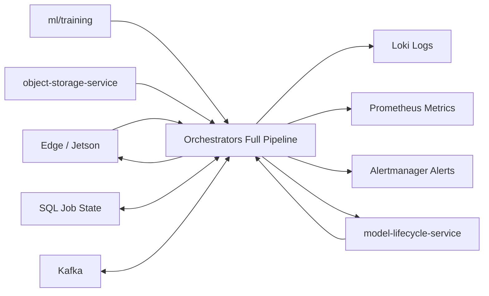
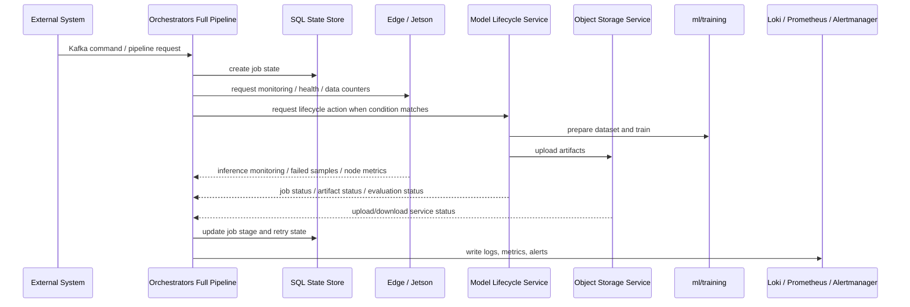
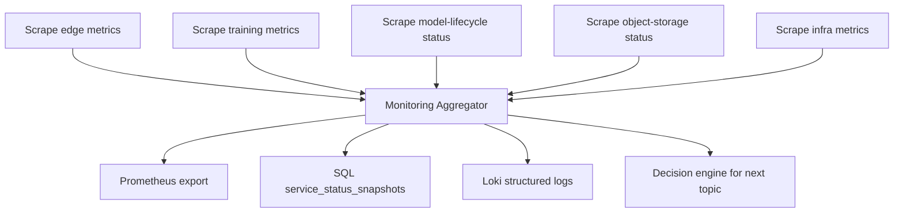
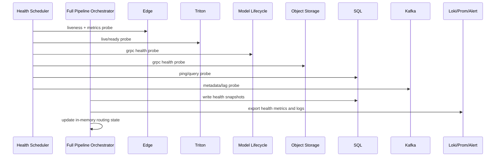
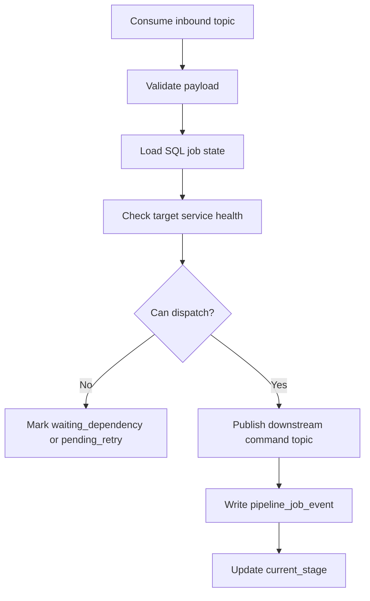
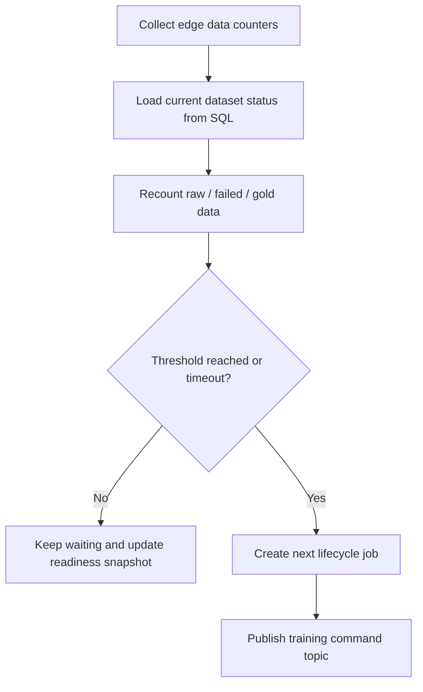
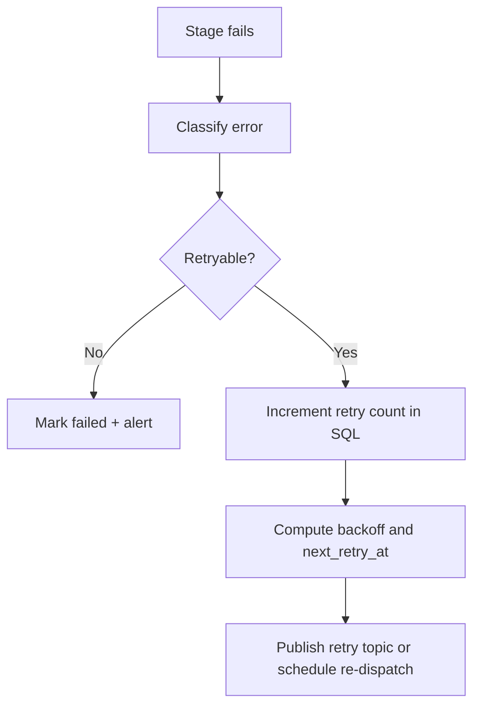
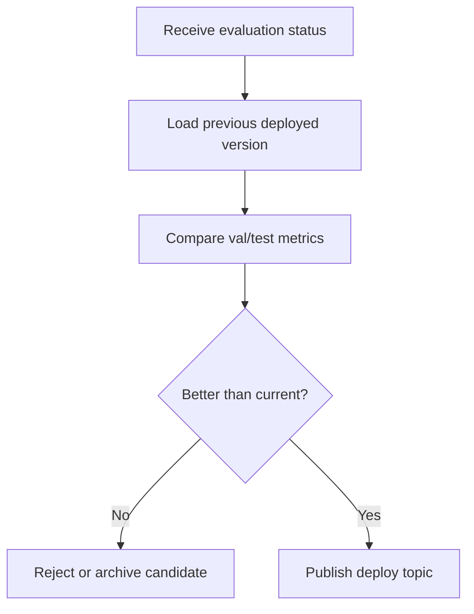
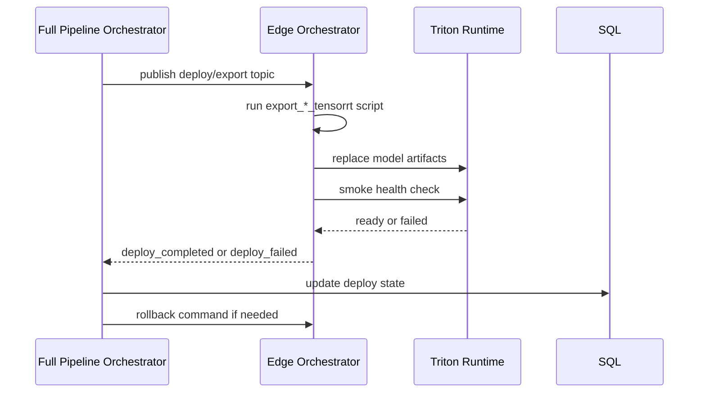

# Orchestrators Full Pipeline Flow

## 1. Overview

Source `services/orchestrators_full_pipeline` là `orchestrator tổng` của toàn bộ hệ AI trong repo này.

Khác với:

- `services/model-lifecycle-service`: điều phối vòng đời model
- `services/object-storage-service`: cấp quyền truy cập MinIO
- `edge/jetson`: chạy inference ngoài edge

source này đứng ở tầng cao hơn để:

- nhận và tổng hợp monitoring từ nhiều source
- theo dõi health toàn hệ thống
- quản lý tiến trình pipeline theo trạng thái SQL
- quyết định khi nào đẩy topic xuống các orchestrator con
- retry job nếu các source con lỗi
- ghi log tập trung vào `Loki`
- export metrics cho `Prometheus`
- bắn cảnh báo qua `Alertmanager`

Quan trọng nhất, đây là nơi nối:

- `edge`
- `ml/training`
- `model-lifecycle-service`
- `object-storage-service`
- `MinIO`
- `MLflow`
- `SQL state`
- `Kafka`
- `Loki / Prometheus / Alertmanager`

Thư mục này hiện đang trống, nên tài liệu này là:

- `target architecture`
- `implementation blueprint`
- `reading guide để sau này code source này`

Sơ đồ vai trò tổng:



---

## 2. Technology Map

Phần này mô tả công nghệ mà source này nên dùng để nhìn vào là hiểu nó làm gì.

### 2.1. Kafka orchestration layer

Công nghệ:

- `Kafka consumer`
- `Kafka producer`
- topic-based workflow
- retry topic hoặc delayed topic

Vai trò:

- nhận event và command từ hệ thống trên
- đẩy command lần lượt xuống `model-lifecycle-service`, `edge`, hoặc source khác
- fan-out và chain workflow theo stage

Nếu nhìn vào phần này, có thể hiểu source này là:

- `workflow event coordinator`

### 2.2. SQL state layer

Công nghệ:

- `PostgreSQL` hoặc SQL tương đương
- bảng trạng thái job
- bảng event log
- bảng retry state

Vai trò:

- lưu trạng thái realtime của từng pipeline job
- biết job đang ở stage nào
- biết source nào thành công, source nào lỗi
- quyết định có retry hay không

Nếu nhìn vào phần này, có thể hiểu source này là:

- `pipeline state authority`

### 2.3. Monitoring aggregation layer

Công nghệ:

- `Prometheus client`
- pull hoặc scrape integration
- custom collector
- service health probes

Vai trò:

- thu thập metrics từ `edge`, `ml/training`, `object-storage-service`, `model-lifecycle-service`
- gom về một nơi để view tổng hệ thống
- xuất metric nội bộ của chính orchestrator tổng

Nếu nhìn vào phần này, có thể hiểu source này là:

- `system observability hub`

### 2.4. Logging aggregation layer

Công nghệ:

- structured logging
- `Loki`
- log correlation bằng `request_id`, `job_id`, `dataset_version`, `model_version`

Vai trò:

- gom log từ workflow
- viết log có thể truy vết end-to-end
- phục vụ debug pipeline nhiều source

Nếu nhìn vào phần này, có thể hiểu source này là:

- `central workflow log writer`

### 2.5. Alerting layer

Công nghệ:

- `Alertmanager`
- Prometheus alert rules

Vai trò:

- cảnh báo khi job stuck
- cảnh báo khi Kafka lag cao
- cảnh báo khi healthcheck fail
- cảnh báo khi retry vượt ngưỡng

Nếu nhìn vào phần này, có thể hiểu source này là:

- `pipeline incident notifier`

### 2.6. Healthcheck scheduler layer

Công nghệ:

- periodic scheduler
- grpc/http/tcp health probes

Vai trò:

- gọi healthcheck định kỳ tới các service
- cập nhật trạng thái server theo chu kỳ
- phát hiện node/service chết sớm

Lưu ý:

- khoảng `10ms/lần` như mô tả nghiệp vụ là rất gắt
- thực tế production thường cần tách:
  - `light probe` nhanh
  - `deep probe` chậm hơn

Nếu nhìn vào phần này, có thể hiểu source này là:

- `service liveness watchdog`

### 2.7. Dataset threshold controller

Công nghệ:

- SQL query
- scheduler
- business rule engine đơn giản

Vai trò:

- đếm số lượng dataset đủ chuẩn
- hoặc đợi đến mốc thời gian nhất định
- khi đạt điều kiện thì phát topic xuống `model-lifecycle-service`

Nếu nhìn vào phần này, có thể hiểu source này là:

- `dataset release gate`

---

## 3. End-to-End System Flow

Đây là luồng tổng thể của orchestrator này.



Luồng này cho thấy source không trực tiếp train model hay upload object.

Nó làm:

- điều phối
- giám sát
- quyết định
- retry
- ghi nhận trạng thái

---

## 4. Main Workflow Stages

Phần này mô tả các stage lớn mà source này phải quản lý.

### 4.1. Monitoring collection stage

Source này thu thập monitoring từ:

- `edge/jetson`
- `ml/training`
- `object-storage-service`
- `model-lifecycle-service`

Loại dữ liệu thu thập:

- CPU
- GPU
- RAM
- SSD
- Kafka lag
- gRPC status
- HTTP status
- training progress
- artifact upload status
- edge inference success/fail

Kết quả:

- ghi vào metrics nội bộ
- ghi vào Loki
- cập nhật health snapshot vào SQL nếu cần

#### 4.1.1. Monitoring mà source này phải hút từ từng source

Từ `edge/jetson`:

- GPU usage realtime
- GPU memory used/free
- CPU usage
- RAM usage
- SSD usage
- Triton live status
- inference throughput
- inference latency
- số sample thành công
- số sample fail
- số sample chưa upload
- export TensorRT status

Từ `ml/training`:

- training started/finished
- epoch hiện tại
- step hiện tại
- train loss
- val loss
- checkpoint latest
- checkpoint best
- tensorboard log path
- training script exit code

Từ `model-lifecycle-service`:

- job state theo từng stage
- download dataset status
- merge `gold_data` status
- train trigger status
- MLflow conversion status
- MinIO upload status
- evaluation status
- deploy request status

Từ `object-storage-service`:

- gRPC health
- MinIO connectivity
- generate upload URL success/fail
- generate download URL success/fail
- bucket create/remove status
- access token generation errors

Từ infrastructure chung:

- Kafka broker health
- Kafka topic lag
- SQL latency
- SQL connection pool usage
- MinIO liveness
- MLflow liveness
- Loki push status
- Prometheus scrape status

#### 4.1.2. Monitoring aggregator nên xử lý dữ liệu như thế nào

Source này không chỉ scrape rồi vứt đi.

Nó cần biến dữ liệu monitoring thành 3 lớp:

1. `raw metrics snapshot`
   Dùng cho Prometheus scrape hoặc push metrics.

2. `operational summary`
   Dùng cho SQL dashboard realtime.
   Ví dụ:
   - edge A đang healthy
   - training job B đang ở epoch 31
   - object-storage-service đang latency cao

3. `decision signal`
   Dùng để kích hoạt workflow.
   Ví dụ:
   - đủ failed sample để tạo `gold_data`
   - training đã xong, mở stage monitoring
   - deploy export fail, cần rollback

#### 4.1.3. Monitoring loop nên chia làm nhiều chu kỳ

Không nên gom mọi thứ vào một vòng polling duy nhất.

Nên tách:

- `fast loop`
  Dùng cho:
  - process alive
  - grpc/http basic status
  - Kafka lag
  - queue depth

- `medium loop`
  Dùng cho:
  - GPU/CPU/RAM/SSD
  - training progress
  - Triton metrics
  - edge inference counters

- `slow loop`
  Dùng cho:
  - dataset readiness recount
  - SQL reconciliation
  - artifact completeness check
  - deploy status consistency

Điểm quan trọng:

- nếu business nói `10ms/lần`, chỉ nên áp dụng cho `light in-memory scheduler tick`
- không nên mỗi `10ms` lại gọi full gRPC/SQL/network check tới tất cả service

#### 4.1.4. Monitoring aggregation flow



### 4.2. Healthcheck stage

Source này phải chủ động check health tất cả server định kỳ:

- `edge orchestrator`
- `triton inference server`
- `web ui`
- `model-lifecycle-service`
- `object-storage-service`
- `MinIO`
- `MLflow`
- `Kafka broker`
- `SQL database`

Mỗi healthcheck nên lưu:

- `service_name`
- `checked_at`
- `latency_ms`
- `status`
- `error_message`

Nếu lỗi:

- tăng error counter
- cập nhật SQL
- có thể bắn alert
- có thể kích hoạt retry hoặc circuit-breaker logic

#### 4.2.1. Danh sách server và loại healthcheck nên có

`edge orchestrator`:

- process up/down
- gRPC hoặc HTTP heartbeat
- lần cuối nhận metrics
- số job edge đang chạy

`triton inference server`:

- HTTP `/v2/health/live`
- HTTP `/v2/health/ready`
- model repository loaded chưa
- inference queue backlog nếu lấy được

`web ui`:

- HTTP 200
- websocket stream còn mở được không
- timestamp cuối cùng nhận frame/result

`model-lifecycle-service`:

- gRPC health
- Kafka worker alive
- SQL connectivity nếu service expose
- số job đang chạy / fail

`object-storage-service`:

- gRPC health
- generate token API health
- MinIO dependency health

`MinIO`:

- TCP reachable
- API reachable
- auth ok
- bucket list/basic op thành công

`MLflow`:

- UI/API reachable
- artifact endpoint reachable
- tracking backend response time

`Kafka broker`:

- broker reachable
- producer send thử lightweight hoặc metadata fetch
- consumer lag có tăng bất thường không

`SQL database`:

- ping ok
- simple query ok
- latency query
- connection pool saturation

#### 4.2.2. Healthcheck result không chỉ có healthy/unhealthy

Nên chia status thành:

- `healthy`
- `degraded`
- `unhealthy`
- `unknown`

Ví dụ:

- `healthy`: service trả lời đúng và latency bình thường
- `degraded`: service còn sống nhưng chậm hoặc error rate tăng
- `unhealthy`: timeout hoặc lỗi lặp lại
- `unknown`: mới khởi động hoặc chưa đủ dữ liệu

Điều này quan trọng vì pipeline không nên đợi đến lúc service chết hẳn mới phản ứng.

#### 4.2.3. Healthcheck scheduling chiến lược

Nên có 3 lớp check:

1. `liveness probe`
   Nhanh nhất, rẻ nhất.
   Ví dụ:
   - process tồn tại
   - TCP mở
   - grpc health trả lời

2. `readiness probe`
   Kiểm tra service có sẵn sàng nhận việc hay không.
   Ví dụ:
   - Triton ready
   - model-lifecycle worker không backlog quá lớn
   - object-storage-service còn nói chuyện được với MinIO

3. `deep dependency probe`
   Kiểm tra sâu hơn nhưng ít thường xuyên hơn.
   Ví dụ:
   - generate upload URL thử
   - query SQL thật
   - kiểm tra artifact endpoint MLflow
   - test fetch metadata Kafka

#### 4.2.4. Khi healthcheck fail thì orchestrator tổng phải làm gì

Không chỉ log lỗi.

Nó phải:

1. cập nhật `service_status_snapshots`
2. tăng counter fail theo `service_name`
3. ghi log vào Loki với `correlation_id`
4. cập nhật `health_state` vào memory cache
5. thông báo tới decision engine
6. dừng route topic mới tới service đang `unhealthy`
7. nếu job đang đợi service đó thì:
   - chuyển sang `waiting_dependency`
   - hoặc `pending_retry`
8. nếu fail liên tục vượt ngưỡng:
   - bắn Alertmanager

#### 4.2.5. Healthcheck all server flow



### 4.3. Topic routing and command dispatch stage

Phần này là lõi control-plane của source này.

Source không chỉ consume topic rồi forward bừa.

Nó phải quyết định:

- topic nào là `signal`
- topic nào là `command`
- topic nào là `status`
- topic nào là `retry`
- topic nào là `dead-letter`

#### 4.3.1. Nhóm topic nên có

`inbound trigger topics`:

- yêu cầu pipeline mới
- edge báo đủ failed samples
- edge báo batch monitoring
- scheduler báo dataset timeout

`downstream command topics`:

- gửi sang `model-lifecycle-service` để train
- gửi sang `model-lifecycle-service` để monitor / convert MLflow
- gửi sang `model-lifecycle-service` để tạo `gold_data`
- gửi sang hệ thống evaluation
- gửi sang edge để deploy/export TensorRT

`status topics`:

- training started
- training failed
- monitoring completed
- gold_data completed
- evaluation passed/failed
- deploy completed/failed

`retry topics`:

- command cần chạy lại sau backoff

`dead-letter topics`:

- event lỗi vượt ngưỡng retry

#### 4.3.2. Rule điều hướng topic

Nếu `dataset_ready == true`:

- publish command xuống `model-lifecycle-service`

Nếu `training_completed == true`:

- publish command sang stage monitoring / MLflow

Nếu `monitoring_completed == true`:

- publish command sang stage `gold_data` hoặc evaluation tùy pipeline

Nếu `gold_data_completed == true`:

- publish command tạo dataset version mới hoặc training vòng tiếp

Nếu `evaluation_passed == true`:

- publish deploy topic xuống downstream

Nếu `service_unhealthy == true`:

- không publish command mới tới service đó
- chuyển job sang `waiting_dependency`

Nếu `retry_needed == true`:

- ghi SQL
- publish vào retry queue hoặc delayed topic

#### 4.3.3. Topic routing phải gắn với SQL state

Đây là điểm rất quan trọng.

Source này chỉ nên publish command khi:

1. job tồn tại trong SQL
2. stage hiện tại hợp lệ
3. service target đang `healthy` hoặc `degraded` nhưng vẫn cho phép
4. idempotency key chưa bị consume thành công trước đó

Nghĩa là Kafka không được là nguồn sự thật duy nhất.

Kafka chỉ là:

- `transport`

SQL mới là:

- `state guard`

#### 4.3.4. Topic routing flow



### 4.4. Dataset readiness gate stage

Source này phải đếm số lượng dataset đủ chuẩn theo rule.

Ví dụ rule:

- đủ số sample mới
- đủ số lượng `gold_data`
- đủ tỉ lệ dữ liệu fail từ edge
- hoặc quá thời gian chờ tối đa

Khi đạt điều kiện:

1. ghi trạng thái vào SQL
2. phát topic xuống `model-lifecycle-service`
3. tạo job chain tiếp theo

Vai trò của stage này là:

- không train quá sớm
- không đợi vô hạn
- có rule rõ để mở pipeline

#### 4.4.1. Dataset gate nên theo dõi gì

- số lượng raw sample mới từ edge
- số lượng failed samples đã được xác nhận
- số lượng `gold_data` sẵn sàng
- phân phối label của recognizer
- phân phối class của detection
- thống kê mean/std nếu pipeline cần
- tuổi của dataset hiện tại
- thời gian từ lần train gần nhất

#### 4.4.2. Dataset gate có 2 kiểu trigger

`volume trigger`:

- đủ số lượng sample
- đủ failed sample
- đủ gold data

`time trigger`:

- quá `N` giờ hoặc `N` ngày thì vẫn phải mở pipeline
- tránh hệ thống đợi mãi không train

#### 4.4.3. Dataset gate flow



### 4.5. Lifecycle trigger stage

Sau khi dataset gate đạt điều kiện, source này phát topic xuống `model-lifecycle-service`.

Payload nên gồm:

- `request_id`
- `job_id`
- `dataset_version`
- `model_name`
- `model_type`
- `reason_triggered`
- `source_system`
- `retry_count`

`model-lifecycle-service` sau đó sẽ:

- tải dataset
- ghép `gold_data`
- gọi train script
- xử lý artifact / MLflow / MinIO

Source hiện tại chỉ:

- phát lệnh
- chờ phản hồi trạng thái
- cập nhật SQL

#### 4.5.1. Lifecycle trigger phải điều hướng theo pipeline con

Nếu là `recognizer`:

- route topic train recognizer
- route topic monitoring recognizer
- route topic gold_data recognizer

Nếu là `detection`:

- route topic train detection
- route topic monitoring detection
- route topic gold_data detection

Như vậy orchestrator tổng phải hiểu:

- model type
- dataset type
- stage tiếp theo tương ứng

### 4.6. Retry orchestration stage

Nếu source con lỗi, orchestrator tổng phải quyết định:

- retry ngay
- retry với backoff
- đưa vào dead-letter
- đánh dấu failed vĩnh viễn

Retry nên dựa trên:

- lỗi tạm thời hay lỗi logic
- số lần retry
- service đang unhealthy hay healthy
- deadline của job còn hay hết

Nguồn retry thông tin:

- Kafka consume error
- gRPC call error
- SQL timeout
- edge unavailable
- model lifecycle worker fail

#### 4.6.1. Retry phải bám stage và target service

Ví dụ:

- lỗi healthcheck `edge` thì không retry deploy ngay nếu edge đang down toàn phần
- lỗi generate upload URL thì retry `artifact upload stage`, không rollback cả pipeline
- lỗi `training command publish` thì retry publish, không tạo job mới

#### 4.6.2. Retry flow



### 4.7. Evaluation follow-up stage

Sau khi `model-lifecycle-service` hoàn tất train và monitoring, source này theo dõi:

- job evaluation status
- metric improvement
- artifact readiness

Nếu version mới tốt hơn:

- phát topic deploy xuống downstream

Nếu không:

- đóng job ở trạng thái rejected hoặc archived

#### 4.7.1. Evaluation decision flow



### 4.8. Deploy follow-up stage

Khi tới bước deploy:

- source này phát topic cho `model-lifecycle-service` hoặc edge flow phù hợp
- edge orchestrator nhận thấy yêu cầu export/deploy
- edge chạy script `export_*_tensorrt`
- edge cập nhật Triton artifacts

Source này theo dõi:

- deploy started
- export completed
- deploy failed
- rollback needed

#### 4.8.1. Deploy and rollback flow



### 4.9. Periodic reconciliation stage

Ngoài event-driven flow, source này nên có một luồng reconciliation định kỳ.

Mục tiêu:

- sửa lệch state giữa Kafka, SQL, và source con
- phát hiện job orphan
- phát hiện status đã đổi nhưng chưa có event
- phát hiện artifact hoặc deploy step thiếu

Luồng này nên làm:

1. quét job `in_progress` quá lâu
2. quét service `degraded/unhealthy`
3. quét topic lag cao
4. quét job `pending_retry` đã tới hạn
5. quét job đã train xong nhưng chưa có monitoring follow-up
6. quét deploy đã bắt đầu nhưng chưa có completed/failed event

---

## 5. Monitoring, Logging, Metrics, And Alerts

### 5.1. Loki logging flow

Source này nên ghi log vào `Loki` với các field chuẩn:

- `request_id`
- `job_id`
- `dataset_version`
- `model_version`
- `stage`
- `service_target`
- `retry_count`
- `status`
- `error_code`

Log cần đủ để trả lời:

- job đang kẹt ở đâu
- source nào bị lỗi
- retry bao nhiêu lần
- dataset nào đã được đưa đi train

### 5.2. Prometheus metrics

Source này nên export ít nhất các metric sau:

- `orchestrator_pipeline_jobs_total`
- `orchestrator_pipeline_jobs_in_progress`
- `orchestrator_pipeline_jobs_failed_total`
- `orchestrator_pipeline_jobs_succeeded_total`
- `orchestrator_pipeline_retry_total`
- `orchestrator_pipeline_retry_exhausted_total`
- `orchestrator_healthcheck_latency_ms`
- `orchestrator_healthcheck_failures_total`
- `orchestrator_kafka_consume_latency_ms`
- `orchestrator_kafka_publish_latency_ms`
- `orchestrator_kafka_lag`
- `orchestrator_sql_query_latency_ms`
- `orchestrator_dataset_ready_total`
- `orchestrator_alerts_sent_total`

Metrics từ source con được tổng hợp hoặc mirror:

- edge GPU/CPU/SSD usage
- Triton inference health
- training progress
- MinIO availability
- model-lifecycle worker health

### 5.3. Alertmanager conditions

Alert nên bắn khi:

- service health fail liên tục
- Kafka lag tăng bất thường
- SQL query timeout liên tục
- job stuck quá lâu
- retry vượt ngưỡng
- dataset gate chờ quá deadline
- deploy fail

### 5.4. Monitoring dashboard mục tiêu

Một dashboard tốt cho source này nên nhìn được:

- tổng số job đang chạy
- health trạng thái từng service
- Kafka topic lag
- tỷ lệ success/fail theo stage
- số retry theo service
- số dataset đã đủ chuẩn
- deploy queue

---

## 6. SQL State Management

SQL trong source này là nơi quản lý trạng thái pipeline tập trung.

### 6.1. Bảng nên có

Ít nhất nên có:

- `pipeline_jobs`
- `pipeline_job_events`
- `pipeline_health_checks`
- `pipeline_retries`
- `dataset_readiness`
- `service_status_snapshots`

### 6.2. `pipeline_jobs`

Nên lưu:

- `job_id`
- `request_id`
- `pipeline_type`
- `dataset_version`
- `model_name`
- `current_stage`
- `status`
- `retry_count`
- `created_at`
- `updated_at`

### 6.3. `pipeline_job_events`

Nên lưu:

- `job_id`
- `stage`
- `event_type`
- `payload`
- `status`
- `created_at`

Vai trò:

- audit trail
- debug realtime
- khôi phục workflow sau restart

### 6.4. `pipeline_retries`

Nên lưu:

- `job_id`
- `stage`
- `retry_attempt`
- `next_retry_at`
- `last_error`
- `resolved`

### 6.5. SQL-driven retry

Source này phải có logic:

1. query job đang `pending retry`
2. kiểm tra `next_retry_at`
3. nếu tới hạn thì publish lại topic
4. update trạng thái retry mới

Như vậy Kafka chỉ là bus, còn SQL mới là:

- `source of truth về state`

---

## 7. Responsibility By Module

Nếu source này được code hoàn chỉnh, nên tách module theo trách nhiệm như sau.

### 7.1. `adapter/inbound/kafka`

Làm:

- consume topic đầu vào
- parse command
- validate payload
- đưa vào application service

### 7.2. `adapter/outbound/monitoring`

Làm:

- đọc metrics từ service khác
- gọi healthcheck grpc/http
- thu thập latency và status

### 7.3. `adapter/outbound/logging`

Làm:

- gửi structured log lên Loki

### 7.4. `adapter/outbound/metrics`

Làm:

- export Prometheus metrics

### 7.5. `adapter/outbound/alerts`

Làm:

- gửi alert tới Alertmanager

### 7.6. `application/use_cases`

Làm:

- quyết định workflow stage
- điều kiện mở dataset gate
- retry policy
- publish topic xuống service con

### 7.7. `application/services`

Làm:

- orchestration logic cấp cao
- gom nhiều use case lại thành một flow

### 7.8. `infra/sql`

Làm:

- lưu và query job state
- transaction cho retry, lock job, update stage

### 7.9. `infra/kafka`

Làm:

- publish/consume
- retry publish
- DLQ handling

---

## 8. Failure And Recovery

### 8.1. Service healthcheck fail

Ví dụ:

- `model-lifecycle-service` down
- `object-storage-service` down
- `edge` mất kết nối

Xử lý:

- ghi log Loki
- tăng metric fail
- cập nhật SQL service status
- bắn alert nếu vượt ngưỡng
- hoãn publish job mới xuống service đó

### 8.2. Kafka publish/consume fail

Xử lý:

- retry với backoff
- lưu retry state vào SQL
- nếu vượt ngưỡng thì DLQ hoặc failed

### 8.3. SQL unavailable

Đây là lỗi nặng vì SQL là state authority.

Xử lý:

- dừng nhận thêm command mới nếu cần
- degrade service
- bắn alert ngay
- tránh phát topic mới mà không ghi được state

### 8.4. Dataset gate không bao giờ đạt

Ví dụ:

- không đủ dữ liệu mới
- gold data quá ít
- failed samples từ edge không đủ

Xử lý:

- timeout theo rule
- phát topic với cờ `forced_run`
- hoặc đánh dấu `waiting_for_more_data`

### 8.5. Retry loop vô hạn

Xử lý:

- có `max_retry`
- có `retry window`
- có `non-retryable error code`

### 8.6. Monitoring flood

Nếu polling quá gắt như `10ms/lần`, hệ thống có thể tự gây quá tải.

Xử lý nên là:

- tách `fast liveness check`
- tách `deep dependency check`
- giới hạn concurrency
- batch metric update

---

## 9. Suggested Source Layout And Reading Order

Vì source hiện chưa code, layout sau là layout khuyến nghị.

```text
services/orchestrators_full_pipeline/
├── cmd/
│   └── orchestrators_full_pipeline/
│       └── main.*
├── config/
│   ├── orchestrators_full_pipeline.yaml
│   └── .env
├── docs/
├── internal/ or src/
│   ├── adapter/
│   │   ├── inbound/
│   │   │   ├── kafka/
│   │   │   └── grpc_or_http/
│   │   └── outbound/
│   │       ├── kafka/
│   │       ├── sql/
│   │       ├── loki/
│   │       ├── prometheus/
│   │       ├── alertmanager/
│   │       └── healthcheck/
│   ├── application/
│   │   ├── services/
│   │   └── use_cases/
│   ├── domain/
│   │   ├── entities/
│   │   ├── value_objects/
│   │   └── policies/
│   └── infra/
│       ├── sql/
│       ├── kafka/
│       └── monitoring/
└── tests/
```

Thứ tự đọc source sau này nên là:

1. `cmd/.../main`
2. `config/`
3. `adapter/inbound/kafka`
4. `application/services`
5. `application/use_cases`
6. `infra/sql`
7. `infra/kafka`
8. `adapter/outbound/healthcheck`
9. `adapter/outbound/prometheus`
10. `adapter/outbound/loki`
11. `adapter/outbound/alertmanager`

---

## 10. Final Position In The Whole System

Nếu nhìn toàn repo, source này không phải nơi xử lý model lõi.

Nó là nơi:

- điều phối liên service
- kiểm soát state toàn pipeline
- gom monitoring
- quyết định trigger workflow
- đảm nhận retry và incident visibility

Nói ngắn gọn:

- `model-lifecycle-service` là orchestrator vòng đời model
- `object-storage-service` là storage gateway
- `edge/jetson` là inference runtime
- `orchestrators_full_pipeline` là `orchestrator của các orchestrator`

Đây là source phù hợp để đứng trên cùng của control plane cho toàn hệ AI production.
